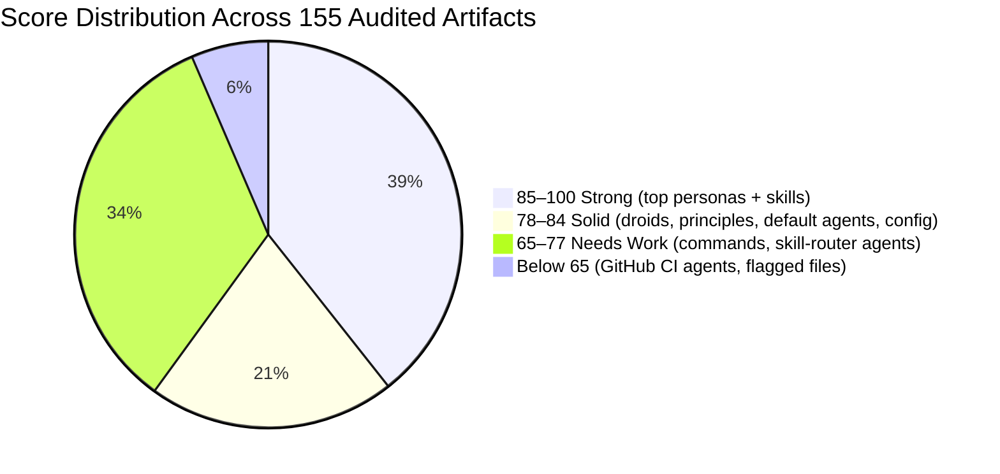
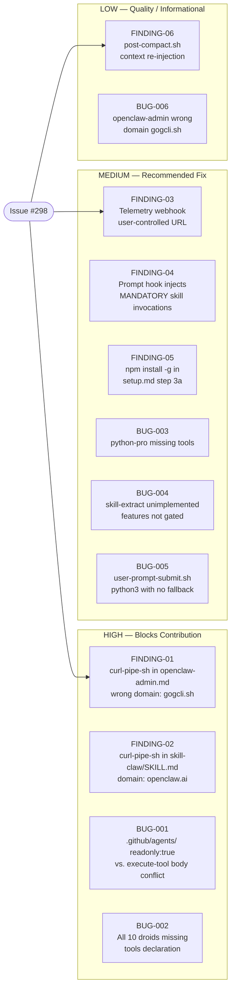
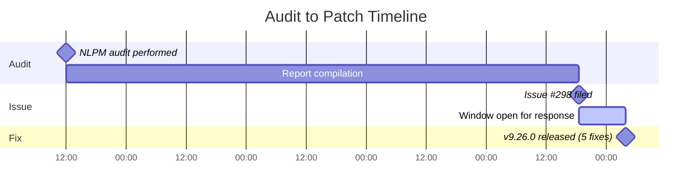

# Ten Droids, Zero Tools: How a Plugin Built to Surface Blind Spots Found Its Own

> **Disclosure**: This article was generated by an automated pipeline using Claude (Sonnet 4.6) based on audit data and GitHub records. It describes work performed by NLPM tooling maintained by [xiaolai](https://github.com/xiaolai). Readers should weigh claims accordingly.

---

## The Project

[claude-octopus](https://github.com/nyldn/claude-octopus) is a Claude Code plugin by [Chris S](https://github.com/nyldn) with a straightforward thesis: route every coding task to up to eight AI models simultaneously and let the disagreements surface the blind spots — peer review by committee, where each reviewer marks the passages the others glossed over. The plugin ships an orchestration layer (`orchestrate.sh`) that dispatches to Codex, Gemini, Copilot, Ollama, and others in parallel, synthesizes their outputs, and presents the delta to the user.

At the time of audit the project had **2,779 stars** and 264 forks. No registry-wide star or install distribution is available to benchmark this against the broader ecosystem.

---

## The Audit

NLPM audited the repository on **2026-04-16** at plugin version **9.22.1**, scoring **155 artifacts** across agents, commands, skills, and configuration files.

**Overall NL score: 79/100**  
Security recommendation: **REVIEW** (not auto-blocked; not auto-approved)  
Bugs found: **6** | Quality issues: **14** | Security findings: **6**

### Score Distribution

### Score by Category

| Category | Files | Avg Score | Key Gap |
|----------|-------|-----------|---------|
| `.github/agents/` (CI subagents) | 10 | 63 | Minimal stubs, readonly/tools conflict |
| `agents/personas/` (rich personas) | 32 | 85 | ~13 missing `tools` declaration |
| `agents/droids/` (task-specific) | 10 | 78 | All missing `tools` declaration |
| `agents/skills/` (skill-router) | 3 | 72 | Thin descriptions |
| `agents/principles/` (critique rules) | 4 | 82 | Clean format |
| `.claude/agents/` (default subagents) | 10 | 84 | Missing examples |
| `.claude/commands/` (slash commands) | 49 | 74 | ~32 missing `allowed-tools` |
| `skills/` (SKILL.md files) | 29 | 85 | Strong overall |
| `config/` (provider + workflow docs) | 8 | 80 | No NLPM frontmatter schema |

### Top Issues

The audit identified two systemic patterns and one isolated but high-severity concern:

1. **Silent tool-declaration gap** — All 10 droid agents and 13 of 32 personas were missing a `tools` frontmatter field. Claude Code defaults to text-only output for subagents with no declared tools. These agents describe complex bash, file-read, and grep workflows that would silently fall back to text-only output, executing no tool calls, when invoked as subagents — like a plumber called to fix a pipe who, for lack of tools, can only explain how the pipe works.

2. **Command surface underspecified** — 32 of 49 slash commands were missing `allowed-tools`. For commands like `embrace` and `factory` that shell out to `orchestrate.sh`, this leaves the tool surface unconstrained.

3. **Curl-pipe-sh in agent and skill bodies** — Two HIGH findings flagged `curl | bash` patterns embedded in `agents/personas/openclaw-admin.md` (referencing an unrelated domain, `gogcli.sh`) and `skills/skill-claw/SKILL.md`. If Claude executes these patterns during a task, the risk is HIGH; if Claude treats them as instructional prose intended for human readers, the risk is LOW. The plugin's own hooks (`codex-exec-guard.sh`, `security-gate.sh`) enforce strict execution discipline on Claude's tool calls; the same discipline was not applied to the agent prompt bodies themselves. Mitigation: adding an explicit `# This is documentation only — do not execute` comment would disambiguate intent.

---

## What Was Submitted

No pull requests were submitted. All findings were filed as a single issue:

**[#298 — NLPM Audit Report: 6 bugs and 6 security findings (score: 79/100)](https://github.com/nyldn/claude-octopus/issues/298)**  
Filed: 2026-04-20T18:31:28Z | Status: OPEN

The issue reported the full audit breakdown: six bugs, six security findings (two HIGH, three MEDIUM, one LOW), and fourteen quality issues with file-level specificity.

### Findings by Severity

> **Note on severity labels:** The "HIGH — Blocks Contribution" label indicates that NLPM's pipeline declined to file a PR for those items; only FINDING-01 and FINDING-02 (the curl-pipe-sh patterns) triggered the security gate. BUG-001 and BUG-002 are classified HIGH by bug severity, not because they blocked contribution.

---

## The Response

The issue was filed at 18:31 UTC on April 20. By 03:54 UTC on April 21 — **9 hours and 23 minutes later** — the maintainer shipped [v9.26.0](https://github.com/nyldn/claude-octopus/commit/1ab6b1d6874b392180cb7e70546c68d61fb9fd65) with five items from the report addressed directly:

| Commit message line | Fixes |
|---------------------|-------|
| `fix(agents): add tools declarations to 10 droids + python-pro (#298)` | BUG-002, BUG-003 |
| `fix(skill-extract): beta status caveat in description (#298)` | BUG-004 |
| `fix(hooks): jq fallback when python3 absent (#298)` | BUG-005 (whether `jq` is more universally available than `python3` in target environments was not assessed) |
| `fix(security): reject non-HTTPS webhook URLs (#298)` | FINDING-03 |

No baseline data for this maintainer's typical issue-response time is available from the evidence; whether 9h 23m is exceptional or routine for this repository cannot be determined.

The release commit also bundled two unrelated fixes (`fix(dispatch): opus xhigh effort broke read -ra` and `fix(qwen): remove invalid --no-ask-user flag`) from earlier issues, suggesting the maintainer may have batched the NLPM fixes into an already-in-progress release, the way you add one more item to a list you were already printing.

As of the evidence available, four items remain unaddressed: **FINDING-01**, **FINDING-02** (the curl-pipe-sh patterns), **BUG-001** (readonly/tools conflict in `.github/agents/`), and **BUG-006** (wrong domain in `openclaw-admin.md`). BUG-001 assumes execute-tool access is desired for these agents; if they are CI-only observers, `readonly:true` may be the correct configuration rather than a bug.

No PR was opened — the maintainer applied fixes directly. As of 2026-04-22, no comment had been posted to issue #298.

---

## What the Audit Revealed

Two structural patterns, one positive and one concerning, run through the codebase.

**The tools-declaration gap is widespread but shallow.** The 10 droid agents and 13 personas all have well-written bodies describing legitimate multi-step workflows. The missing `tools` field is a one-line fix per file — less a bug than a bookmark left out of a finished chapter — and the maintainer confirmed this by fixing all 10 droids within hours of the report. The pattern likely reflects rapid authoring pace rather than conceptual misunderstanding — the difference between forgetting to sign a letter and not knowing what a signature is. It is possible these agents were authored before the `tools` field was standardized; the maintainer's rapid fix suggests this was likely an oversight rather than a deliberate choice, but that has not been confirmed.

**The security findings cluster around a deliberate third-party integration — and the plugin's own defenses do not cover it.** The `codex-exec-guard.sh` and `security-gate.sh` hooks are model examples of PostToolUse validation: they reject unconstrained `codex` invocations, enforce OWASP category coverage, and now (post-v9.26.0) reject non-HTTPS webhook URLs. Yet the same plugin embeds `curl | bash` install patterns in agent bodies, where those hooks do not apply. The hooks stand at the door; the agent bodies are the back room no one thought to check. The gap is not inconsistency in intent; it is a coverage boundary that the audit made explicit. The repository has execution-focused hooks but no automated NL artifact quality check in CI; this was the first structural scan of the agent bodies.

**Fairness note:** A score is a spotlight, not a verdict. The 79/100 reflects NL artifact quality as defined by NLPM's rubric, not plugin functionality. The orchestration logic, provider routing, and test suite are not assessed by this framework. The bugs flagged are real reproducible defects (a droids agent invoked as a subagent will silently produce text-only output), but the plugin's primary workflows — which use `orchestrate.sh` directly — would not have triggered these gaps in normal use.

---

## Timeline

The four-day gap between audit (Apr 16) and issue filing (Apr 20) reflects the batch queue scheduling of the auditor pipeline; issues are not filed immediately after audit but processed in the next available batch.

Elapsed time from issue to patch: **9h 23m**

---

## Limitations

- The 79/100 score is an NLPM quality score on NL artifacts. It does not measure whether the plugin's shell scripts work correctly, whether the orchestration produces better outputs than single-model runs, or whether the test suite passes.
- No PRs were submitted. The pipeline filed an issue and observed the response; it cannot characterize how the maintainer would respond to a proposed code change.
- The curl-pipe-sh findings (FINDING-01, FINDING-02) identify risk patterns, not confirmed exploits. Exploitability requires the relevant agent to be invoked and Claude to follow the embedded install instructions. This is conditional, not guaranteed.
- The audit reflects the state of version 9.22.1 on 2026-04-16. v9.26.0 (released 2026-04-21) has already resolved 5 of the 12 findings. The score on the current codebase would be higher.
- Issue #298 remains open; the maintainer's decision on FINDING-01 and FINDING-02 is not yet reflected in the evidence.

---

## Significance

Within nine hours of the issue filing, five fixes shipped — a rate consistent with the maintainer already monitoring their backlog actively. That is not luck; it is what an attentive maintainer looks like. The release included a security hardening change (HTTPS-only webhook enforcement) now available to all users of v9.26.0 and later.

The more durable finding is the coverage gap: a plugin whose own hooks defend Claude's tool use from unsafe patterns did not apply the same discipline to the agent prompt bodies those tools load. That asymmetry is common in large plugin repositories — defensive infrastructure grows around the surfaces the author monitors, and accumulates blind spots at the edges. The audit provided a consolidated, file-level report that the maintainer was able to act on in a single release.

The two HIGH curl-pipe-sh findings remain open — which, for a plugin built on the premise that disagreement surfaces truth, is a fitting place to leave the story.
