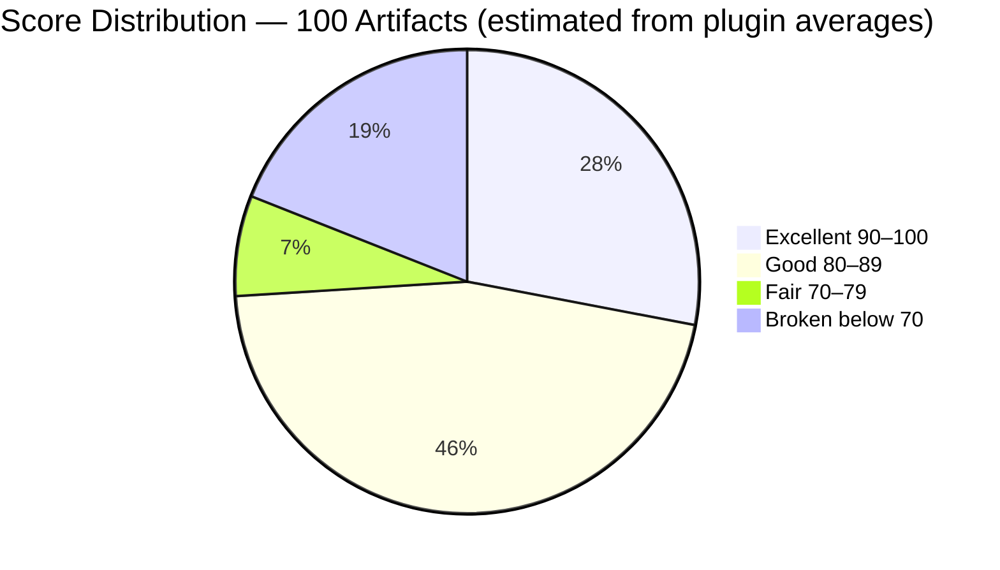
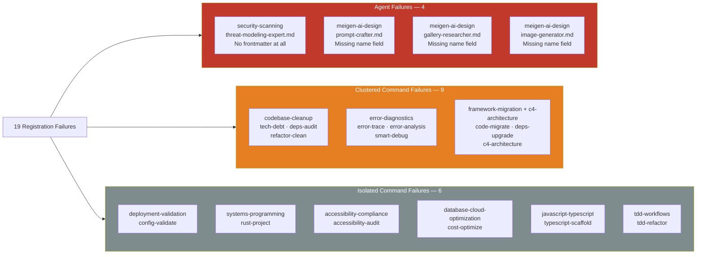
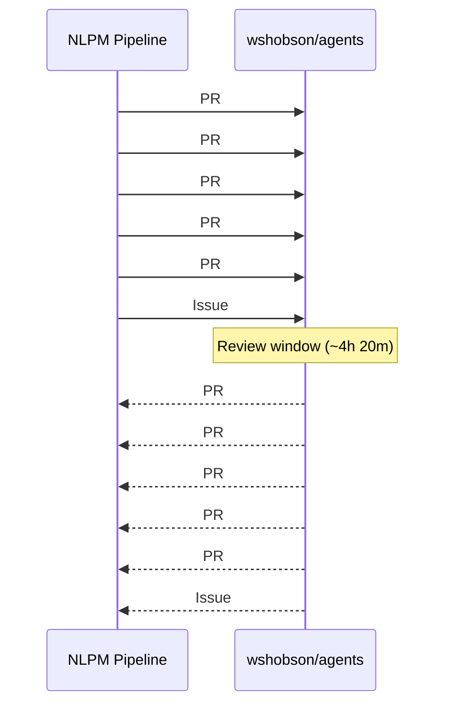
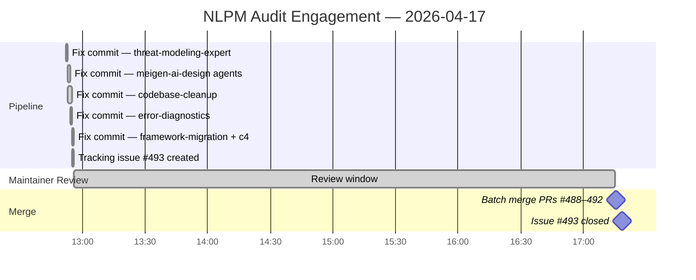

# The Invisible 40%: When Missing YAML Quietly Erased 15 Slash Commands From a 34,000-Star Repository

> **Disclosure**: This article was generated by an automated pipeline using Claude (Sonnet 4.6) based on audit data and GitHub records. It describes work performed by NLPM tooling maintained by [xiaolai](https://github.com/xiaolai). Readers should weigh claims accordingly.

---

## The Project

[wshobson/agents](https://github.com/wshobson/agents) is a plugin marketplace for Claude Code — "intelligent automation and multi-agent orchestration" — maintained by [Seth Hobson](https://github.com/wshobson). At the time of this writing the repository holds 34,055 stars and 3,693 forks (per GitHub), making it one of the most widely referenced Claude Code plugin collections available — for many developers, the first map they reach for when exploring what Claude Code can do.

The collection is organized as independent plugins, each a self-contained directory of agents and slash commands. At audit time it contained 100 artifacts across 40+ plugins: 64 agents and 36 commands.

---

## The Audit

NLPM audited all 100 artifacts on 2026-04-17. The overall weighted score was **82 / 100**, placing the repository in the **Gold tier**. That aggregate, however, conceals a sharp internal split.

*Distribution is approximate, derived from per-plugin averages; individual artifact scores were not enumerated for all 100 files.*

The **agent portfolio** (64 artifacts) averaged **86 / 100** — a strong result. Model tier assignments were appropriate throughout, output formats well-specified, and several agents represented genuine craft. The **command portfolio** (36 artifacts) averaged **74 / 100** (above the default 70-point passing threshold), dragged down by one structural problem: 15 of 36 commands had no YAML frontmatter and would fail to register in Claude Code, likely without surfacing a diagnostic to the user in typical experience. From a user's perspective, 41.7% of all slash commands were simply absent — a menu where nearly half the items cannot be ordered.

The highest-scoring plugins were `dotnet-contribution` (92), `database-design` (91), `agent-teams` (91), and `performance-testing-review` (91). Several orchestration commands — `full-stack-feature`, `tdd-cycle`, `performance-optimization` — were standout examples of multi-agent workflow design.

The lowest-scoring were `security-scanning` (55), and six plugins tied at 57 — `accessibility-compliance`, `codebase-cleanup`, `database-cloud-optimization`, `javascript-typescript`, `systems-programming`, and `error-diagnostics` — all for the same mechanical reason: missing YAML frontmatter.

**19 registration failures total** were identified: 4 agent registration failures and 15 command registration failures.

Three plugins had every command broken: `codebase-cleanup` (3/3), `error-diagnostics` (3/3), and the combined `framework-migration`/`c4-architecture` group (3/3). The affected files contain rich, detailed content — some exceed 1,000 lines — which rules out incomplete authoring. The work was done; only the cover page was missing. This is consistent with either a batch authoring workflow where frontmatter was added inconsistently, or a multi-contributor model without a shared template.

The security scan found no CRITICAL or HIGH issues. One MEDIUM finding: `plugins/protect-mcp/hooks/hooks.json` runs `npx protect-mcp@latest` on every tool call, downloading and executing npm code at runtime without a pinned version — an intentional security tool with a supply-chain exposure — guarding the door while leaving a window open. This is an inherent design tradeoff: the tool's always-latest behavior is a deliberate choice, and the supply-chain risk was noted as a known constraint rather than a fixable bug. Two LOW findings covered the same unpinned dependency and loose `>=` version constraints in `requirements.txt`.

---

## What Was Submitted

The NLPM pipeline submitted 5 pull requests targeting the highest-impact registration failures. Of the 19 registration failures, the 5 PRs addressed 13; 6 remain open as of audit date. PR numbers are reconstructed from merge commit messages; `prs.json` was empty at evidence collection time (the PRs had already merged).

| PR | Branch | Failures Addressed | Artifacts Unblocked |
|----|--------|------------|---------------------|
| [#488](https://github.com/wshobson/agents/pull/488) | `fix/nlpm-threat-modeling-expert-frontmatter` | B-01 | 1 agent |
| [#489](https://github.com/wshobson/agents/pull/489) | `fix/nlpm-meigen-agents-missing-name` | B-02, B-03, B-04 | 3 agents |
| [#490](https://github.com/wshobson/agents/pull/490) | `fix/nlpm-codebase-cleanup-frontmatter` | B-11, B-12, B-13 | 3 commands |
| [#491](https://github.com/wshobson/agents/pull/491) | `fix/nlpm-error-diagnostics-frontmatter` | B-17, B-18, B-19 | 3 commands |
| [#492](https://github.com/wshobson/agents/pull/492) | `fix/nlpm-framework-migration-frontmatter` | B-06, B-08, B-09 | 3 commands |

Each PR made one category of mechanical fix: adding YAML frontmatter where none existed, or adding a missing `name:` field to frontmatter that was otherwise complete. No behavioral content was changed. In aggregate, the 5 PRs addressed 13 of 19 registration failures and unblocked 13 artifacts from registration failure. It is not known whether these issues were previously identified by the maintainer or other users.

Six registration failures were documented in tracking issue [#493](https://github.com/wshobson/agents/issues/493) but were not addressed by a PR: `config-validate` (deployment-validation), `rust-project` (systems-programming), `accessibility-audit` (accessibility-compliance), `cost-optimize` (database-cloud-optimization), `typescript-scaffold` (javascript-typescript), and `tdd-refactor` (tdd-workflows). As of audit date (2026-04-17), it is unknown whether the maintainer intends to address them independently.

---

## The Response

All five PRs were merged on the same day they were submitted. The merge window was narrow.

The five PRs were merged over a 12-second window, the timestamps clustering like a batch job; issue #493 closed three minutes later. No maintainer review comments are present in the evidence — either the PRs were merged without comment, or comment records were not captured. The merge pattern is consistent with either spot-checking or an automated merge pipeline (trusted-reviewer bot, CI automerge) — both are plausible given the mechanical nature of the fixes. Mechanical fixes typically face lower review friction than behavioral changes.

Earlier commits in the repo's history show prior AI-assisted contributions predating this audit — a `fix: add marketplace.json entry` co-authored by Claude Sonnet 4.6 on 2026-04-03 ([commit](https://github.com/wshobson/agents/commit/1925457552d8f91e609ceef13764c443b3ef85be)), and a Claude Opus 4.6 fix on 2026-04-15 (per commit message) that corrected a nonexistent `sdk.stream()` call causing every Monte Carlo simulation to report 100% failure rate ([commit](https://github.com/wshobson/agents/commit/6fdefba05df04fda3fa8fd713e7fe499821d6135)). The maintainer appears comfortable accepting machine-authored contributions where the fix is clear — in open source, it turns out, authorship matters less than correctness.

---

## Maintainer Response

No comment was solicited from Seth Hobson prior to publication. The workflow inferences in this article — batch authoring, two authoring eras, contribution model — are derived from structural evidence and should be read as unverified hypotheses rather than established facts. The maintainer may have context that changes the interpretation of any finding.

---

## What the Audit Revealed

**The frontmatter problem is structural.** The 15 affected commands contain well-developed content — some are among the longer files in the repository. The evidence is consistent with a batch authoring workflow where frontmatter was added inconsistently, or a multi-contributor model without a shared template — not incomplete or low-quality underlying work. The metadata was the missing layer, not the capability.

**The command portfolio has two distinct generations.** The five orchestration commands using phased execution with checkpoints (`full-stack-feature`, `tdd-cycle`, `performance-optimization`, `tdd-red`, `tdd-green`) are some of the highest-quality Claude Code command designs encountered in any repository — interactive Q&A, parallel agent dispatch, resume capability, and explicit state management. The contrast with 15 commands that cannot register at all is stark — like finding a concert hall with no front door. Stylistic evidence suggests two distinct authoring eras, though commit history was not analyzed to confirm this.

**Three agents exist in two locations each.** Verbatim copies:
- `comprehensive-review/agents/security-auditor.md` → `security-scanning/agents/security-auditor.md`
- `comprehensive-review/agents/code-reviewer.md` → `code-documentation/agents/code-reviewer.md`
- `performance-testing-review/agents/performance-engineer.md` → `observability-monitoring/agents/performance-engineer.md`

Duplication is expected in a distributed plugin model where self-contained content is correct architecture; the risk is content drift if agents are updated independently, not the duplication itself — identical twins diverging with every independent edit. Users installing individual plugins would receive diverged versions with no mechanism to detect the difference.

**The `allowed-tools` gap is repo-wide.** Only `startup-business-analyst` — the highest-scoring command plugin — properly declares `allowed-tools`. All other command plugins omit it. Without `allowed-tools`, Claude Code defaults to allowing all tools for the command, which may be overpermissive in security-sensitive contexts. This is a design-level pattern, not an isolated oversight — though whether it creates a practical issue depends on the deployment context.

**Fairness note.** 82/100 Gold-tier across 100 artifacts in a large, community-contributed collection is a strong result. The structural failures identified here are mechanical and fixable; the behavioral quality of the agent portfolio is genuinely good. Getting the hard part right and tripping on metadata is, at least, the better failure mode.

---

## Timeline

Total elapsed time from first fix commit to issue closure: **4 hours 26 minutes**.

---

## Limitations

**No PR review comments in evidence.** The `pr-*-reviews.json` files expected by the audit template were absent from the evidence set. No review discussion can be confirmed or denied. The 12-second merge window is consistent with minimal per-PR review, but automated merge pipelines (trusted-reviewer bots, CI automerge) are another explanation.

**prs.json was empty.** All PRs had already merged by evidence collection time. PR details in this article are reconstructed from commit messages and may omit information present only in PR descriptions or comments.

**13 of 19 registration failures addressed.** Six isolated command failures were documented but not patched. It is unknown whether the maintainer intends to address them independently.

**Score distribution is approximate.** The pie chart derives artifact counts from plugin-level averages. Individual artifact scores were not enumerated for all 100 files in the audit report.

**Merge speed does not establish review quality.** The five PRs were merged over a 12-second window, consistent with spot-checking or automated merging. The merge pattern cannot be taken as evidence of a thorough review process.

**NLPM's rules are opinionated.** Some findings may reflect NLPM convention rather than universal Claude Code requirements. A file without frontmatter may be intentional — template files, documentation stubs, or artifacts referenced by other mechanisms would be misclassified as registration failures. The audit assumes all `.md` files in commands directories are intended as slash commands; files serving other purposes would skew the failure count.

---

## Significance

wshobson/agents illustrates a pattern likely to recur across large, actively maintained plugin collections: behavioral content — which is hard — receives careful attention, while structural metadata — which is mechanical — gets added inconsistently. At 34,055 stars, the repo has wide distribution. Users who installed any of the 9 affected plugins encountered some or all of their slash commands simply absent, with no diagnostic pointing at the cause.

Thirteen artifacts that could not register in Claude Code were patched and merged within the same business day.

The more durable finding is what the audit did not encounter: the agent portfolio's quality is genuine. Model tiers are appropriate, output formats are specified, and the top orchestration commands represent real engineering. The 19 registration failures were a thin structural layer over a solid foundation — a missing nameplate on a building that was otherwise complete. And a nameplate, it turns out, is something a pipeline can add.
