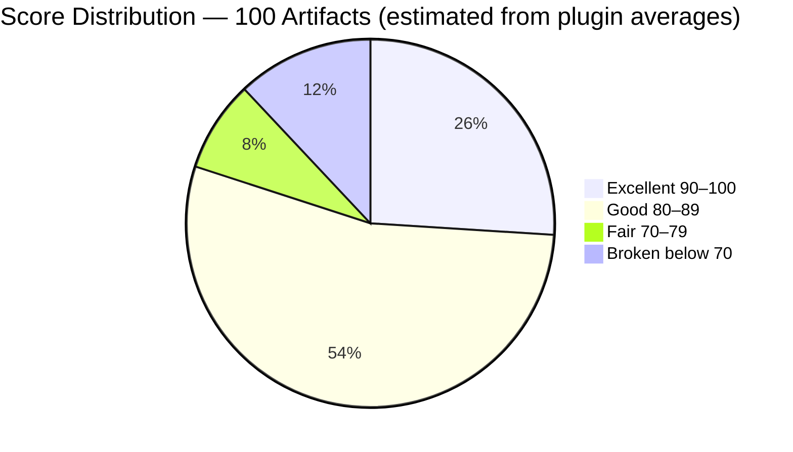
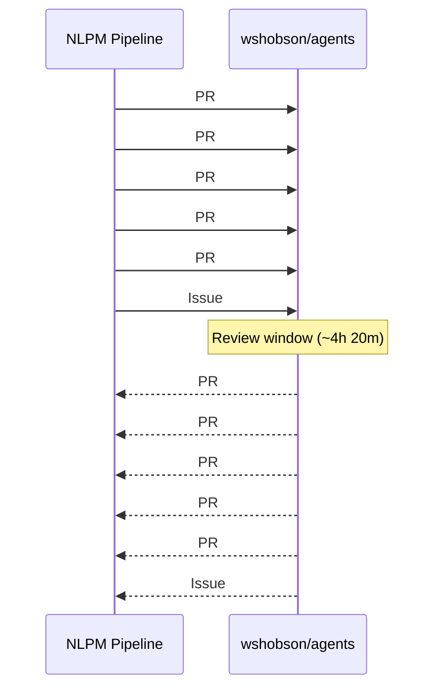
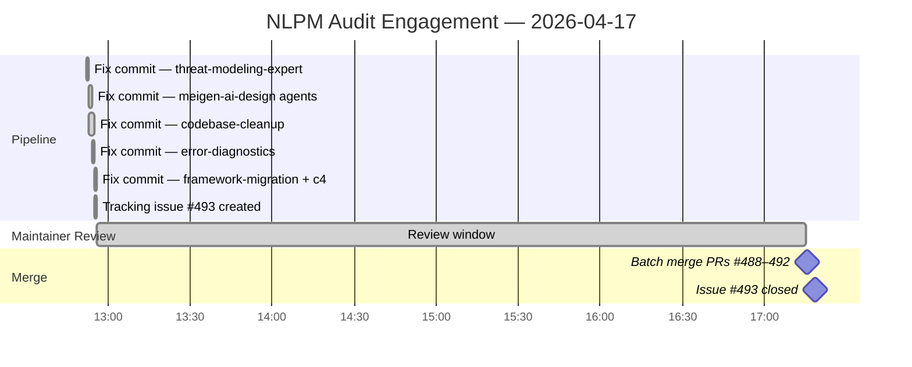

# The Invisible 40%: How Missing YAML Quietly Erased 15 Slash Commands and 4 Agents From a 34,000-Star Repository

> **Disclosure**: This article was generated by an automated pipeline using Claude (Sonnet 4.6) based on audit data and GitHub records. It describes work performed by NLPM tooling maintained by [xiaolai](https://github.com/xiaolai). **This article was generated by the same pipeline that submitted the PRs described below. Readers should treat both the audit findings and the PR quality assessment as self-reported.** Readers should weigh claims accordingly.

---

## The Project

[wshobson/agents](https://github.com/wshobson/agents) is a plugin marketplace for Claude Code, described as "intelligent automation and multi-agent orchestration." It is maintained by [Seth Hobson](https://github.com/wshobson) and, at 34,067 stars and 3,695 forks, is one of the most widely distributed Claude Code plugin collections in existence. For many developers, it is the first place they look when exploring what Claude Code can do beyond the defaults — a well-stocked pantry in a kitchen most users are still learning to navigate.

The repository is organized as independent plugins — each a self-contained directory of agents and slash commands. At audit time it contained 100 artifacts across 40+ plugins: 64 agents and 36 commands.

---

## The Audit

NLPM audited all 100 artifacts on 2026-04-17. The overall weighted score was **82 / 100**, placing the repository in the **Gold tier**. That aggregate conceals a sharp internal split — smooth from thirty thousand feet, uneven underfoot.

*Distribution is approximate, derived from per-plugin averages; individual artifact scores were not enumerated for all 100 files.*

The **agent portfolio** (64 artifacts) averaged **86 / 100**. Model tier assignments were appropriate throughout, output formats were well-specified, and several agents represented genuine craft. The **command portfolio** (36 artifacts) averaged **74 / 100** (above the default 70 passing threshold), dragged down by one structural problem: 15 of 36 commands had no YAML frontmatter and would silently fail to register in Claude Code. From a user's perspective, 41.7% of all slash commands were simply absent — a menu where nearly half the items cannot be ordered, with no error message explaining why.

The highest-scoring plugins were `dotnet-contribution` (92), `database-design` (91), `agent-teams` (91), and `performance-testing-review` (91). Several orchestration commands — `full-stack-feature`, `tdd-cycle`, `performance-optimization` — stood out as exemplary multi-agent workflow designs: interactive Q&A, parallel agent dispatch, resume capability, and explicit state management.

The lowest-scoring plugins were `security-scanning` (55) and six plugins tied at 57 — `accessibility-compliance`, `codebase-cleanup`, `database-cloud-optimization`, `javascript-typescript`, `systems-programming`, and `error-diagnostics` — all for the same mechanical reason: missing YAML frontmatter.

**19 registration failures total**: 4 agent failures and 15 command failures, distributed across 9 plugins.

---

## What Was Submitted

The NLPM pipeline submitted 5 pull requests targeting the highest-impact registration failures, focusing on plugins where all commands or agents were broken.

The 5 PRs addressed 13 of 19 registration failures. Six isolated failures (one per plugin) were documented in the tracking issue but were not patched. Issue #493 was closed by the maintainer without recorded comment; whether the 6 remaining failures will be addressed is not known. PR numbers are reconstructed from merge commit messages; `prs.json` was empty at evidence collection time as the PRs had already merged.

| PR | Branch | Failures Addressed | Artifacts Unblocked |
|----|--------|-------------------|---------------------|
| [#488](https://github.com/wshobson/agents/pull/488) | `fix/nlpm-threat-modeling-expert-frontmatter` | B-01 | 1 agent |
| [#489](https://github.com/wshobson/agents/pull/489) | `fix/nlpm-meigen-agents-missing-name` | B-02, B-03, B-04 | 3 agents |
| [#490](https://github.com/wshobson/agents/pull/490) | `fix/nlpm-codebase-cleanup-frontmatter` | B-11, B-12, B-13 | 3 commands |
| [#491](https://github.com/wshobson/agents/pull/491) | `fix/nlpm-error-diagnostics-frontmatter` | B-17, B-18, B-19 | 3 commands |
| [#492](https://github.com/wshobson/agents/pull/492) | `fix/nlpm-framework-migration-frontmatter` | B-06, B-08, B-09 | 3 commands |

Each PR made one category of mechanical fix: adding YAML frontmatter where none existed, or adding a missing `name:` field to frontmatter that was otherwise complete — three agents that had a full biography but no byline. No behavioral content was changed.

---

## The Response

All five PRs were merged on the same day they were submitted — on a repository this active, that outcome is not guaranteed.

The five PRs were merged over a 12-second window; issue [#493](https://github.com/wshobson/agents/issues/493) closed three minutes later. No maintainer review comments were present in the evidence — either the PRs were merged without inline comment, or comment records were not captured. The batch merge pattern is consistent with either an automated merge pipeline or spot-checking of mechanical fixes. Mechanical fixes — adding a YAML header to a file that lacks one — typically face lower review friction than behavioral changes — closer to spotting a typo than questioning an argument.

Earlier commits show the repository has a history of AI-assisted contributions. A fix co-authored by Claude Sonnet 4.6 landed on 2026-04-03 ([commit](https://github.com/wshobson/agents/commit/1925457552d8f91e609ceef13764c443b3ef85be)), and a Claude Opus 4 (fast mode) fix on 2026-04-15 corrected a nonexistent `sdk.stream()` call that was causing every Monte Carlo simulation to report 100% failure rate ([commit](https://github.com/wshobson/agents/commit/6fdefba05df04fda3fa8fd713e7fe499821d6135)). Prior commits show the maintainer has accepted AI-co-authored fixes; no objection to machine authorship was recorded in the PR comments. The maintainer was not contacted for comment; this article relies solely on public GitHub records.

---

## What the Audit Revealed

**The frontmatter problem is structural, not a quality signal.** The 15 affected commands contain well-developed content — some exceed 1,000 lines of detailed examples and specifications. The work was done; only the cover page was missing. This is consistent with a batch authoring workflow where frontmatter was added inconsistently, or a multi-contributor model without a shared template, not with incomplete or low-quality underlying work. Commit history was not analyzed to determine the origin of the frontmatter omissions. Note also that some files in commands directories may be intentional templates or documentation stubs rather than registered commands; the audit assumes all such files were intended for registration, which may inflate the failure count. wshobson/agents accepts community PRs; the authorship split of the 15 affected files was not analyzed.

**The command portfolio shows two generations.** The five orchestration commands using phased execution with checkpoints (`full-stack-feature`, `tdd-cycle`, `performance-optimization`, `tdd-red`, `tdd-green`) are standout examples of multi-agent Claude Code workflow design. The contrast with 15 commands that cannot register at all is sharp — like finding a concert hall with no front door. Stylistic evidence suggests two distinct authoring eras; commit history was not analyzed to confirm this.

**Three agents exist verbatim in two locations each.** Exact copies:
- `comprehensive-review/agents/security-auditor.md` → `security-scanning/agents/security-auditor.md`
- `comprehensive-review/agents/code-reviewer.md` → `code-documentation/agents/code-reviewer.md`
- `performance-testing-review/agents/performance-engineer.md` → `observability-monitoring/agents/performance-engineer.md`

In a distributed plugin model, self-contained content is expected and duplication may be a packaging requirement rather than technical debt. The risk is not the duplication itself but content drift — identical twins diverging with every independent edit, with no mechanism to detect the difference — or remember which twin drifted first.

**The `allowed-tools` gap is repo-wide.** Only `startup-business-analyst` properly declares `allowed-tools` on its commands — and it is, perhaps not coincidentally, the highest-scoring command plugin. All other command plugins omit it, defaulting to full tool access. This is a design-level pattern across the repository. Omitting `allowed-tools` grants full tool access by default, reducing configuration friction at the cost of least-privilege security; for an advanced-user plugin collection this may be a deliberate trade-off rather than an oversight.

**Fairness note.** 82/100 Gold-tier across 100 artifacts in a large, community-contributed collection is a strong result. The structural failures identified here are mechanical and fixable; the behavioral quality of the agent portfolio is genuinely good. Getting the hard part right and tripping on metadata is, at least, the better failure mode — a stumble at the finish line is still a lap completed.

---

## Timeline

Total elapsed time from first fix commit to issue closure: **4 hours 26 minutes** (measured from first PR at 12:52 to issue close at 17:18; the review window itself was ~4h 20m, measured from last PR submission to first merge).

---

## Limitations

**No PR review comments in evidence.** The `pr-*-reviews.json` files expected by the audit template were absent. No review discussion can be confirmed or denied. The 12-second merge window is consistent with minimal per-PR review, but automated pipelines are an equally valid explanation.

**`prs.json` was empty.** All PRs had already merged by evidence collection time. PR details are reconstructed from commit messages and may omit information present only in PR descriptions or comments.

**13 of 19 registration failures addressed.** Six isolated command failures were documented but not patched. Their status as of this writing is unknown.

**Score distribution is approximate.** The pie chart derives artifact counts from plugin-level averages, not individual artifact scores.

**Merge speed does not establish review quality.** A 12-second merge window is consistent with both spot-checking and automated merging; no inference about review thoroughness should be drawn from timing alone.

**NLPM rules are opinionated.** Some findings may reflect NLPM convention rather than universal Claude Code requirements. A `.md` file in a commands directory may be an intentional template or documentation stub rather than a broken slash command. The audit assumes all such files are intended for registration; files serving other purposes would inflate the failure count.

---

## Significance

wshobson/agents illustrates a pattern likely to recur across large, actively maintained plugin collections: behavioral content — which requires expertise — receives careful attention, while structural metadata — which is mechanical — gets added inconsistently, the way a carefully written letter can still go undelivered for a missing stamp. At 34,067 stars, the repository has wide distribution. Users who installed any of the 9 affected plugins found some or all of their slash commands simply absent, with no diagnostic pointing at the cause.

Thirteen artifacts that could not register in Claude Code were patched and merged within the same business day. Six of the 19 failures — `config-validate`, `rust-project`, `accessibility-audit`, `cost-optimize`, `typescript-scaffold`, and `tdd-refactor` — remain unaddressed as of this writing. The more durable finding is what the audit did not encounter: the agent portfolio's quality is genuine. Model tiers are appropriate, output formats are specified, and the top orchestration commands represent real engineering. The 19 registration failures were a thin structural layer over a solid foundation — a missing nameplate on a building that was otherwise complete. Mechanical fixes of this category are well-suited to automated tooling, provided the tooling's assumptions about file intent are correct. The building was always there; it just needed a legible address.
