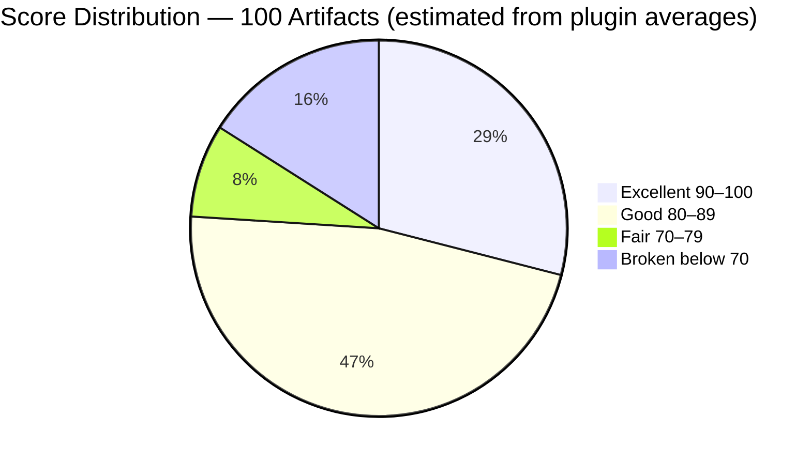
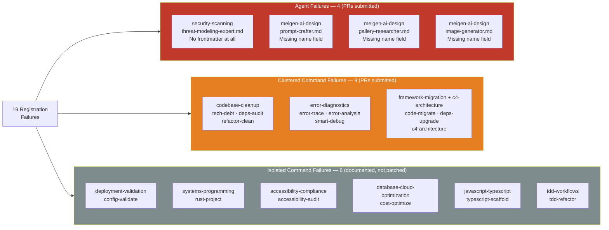
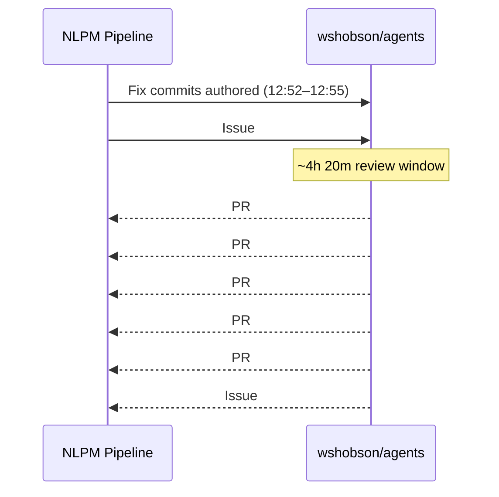

# The Missing Nameplate: What 19 Silent Failures Teach About Metadata Hygiene in a 34,000-Star Plugin Collection

> **Disclosure**: This article was generated by an automated pipeline using Claude (Sonnet 4.6) based on audit data and GitHub records. It describes work performed by NLPM tooling maintained by [xiaolai](https://github.com/xiaolai). Readers should weigh claims accordingly.

---

## The Project

[wshobson/agents](https://github.com/wshobson/agents) is a plugin marketplace for Claude Code maintained by [Seth Hobson](https://github.com/wshobson). Described as "intelligent automation and multi-agent orchestration for Claude Code," the repository distributes its content as independent plugins — each a self-contained directory of agent definitions and slash commands. At the time of audit it contained **100 artifacts across 40+ plugins**: 64 agents and 36 commands. With **34,085 stars** and 3,695 forks, it is one of the most widely distributed Claude Code plugin collections available — frequently the first repository developers encounter when exploring what Claude Code can do beyond its defaults — and for many, the first impression the Claude Code ecosystem makes.

---

## The Audit

NLPM audited all 100 artifacts on 2026-04-17. The overall weighted score was **82 / 100**, placing the repository in the **Gold tier** (80–89). That number conceals a sharp internal divide — a weighted average doing quietly what weighted averages do.

*Distribution is approximate, derived from per-plugin averages; individual artifact scores were not enumerated for all 100 files.*

*Framed differently: 19 of 100 artifacts failed a binary registration check — a 19% failure rate that the tier label partially obscures. No comparable multi-plugin NLPM benchmark exists to date; this score cannot be contextualized against community norms.*

The **agent portfolio** (64 artifacts) averaged **86 / 100** — a strong result. Model tier assignments were consistently appropriate: Opus for production-grade security and architecture agents, Sonnet for documentation and debugging, Haiku for high-throughput lightweight tasks. Output formats were well-specified, and several orchestration agents — `full-stack-feature`, `tdd-cycle`, `performance-optimization` — were exemplary multi-agent workflow designs with phased execution, interactive Q&A, parallel dispatch, and resume capability.

The **command portfolio** (36 artifacts) averaged **74 / 100** — above the default 70 threshold, though pulled below the agent portfolio average by a single structural problem: **15 of 36 commands had no YAML frontmatter**, causing them to fail registration in Claude Code. The remaining 6 registration failures were agent-level bugs (4 agents). Users who installed any of the 9 affected plugins would have found some or all of their slash commands simply absent, with no error message to explain why — like a light switch installed with no wire behind the wall.

Top-performing plugins: `dotnet-contribution` (92), `database-design` (91), `agent-teams` (91), `performance-testing-review` (91). Lowest: `security-scanning` (55) and six plugins tied at 57 — `accessibility-compliance`, `codebase-cleanup`, `database-cloud-optimization`, `javascript-typescript`, `systems-programming`, and `error-diagnostics` — all for the same mechanical reason: missing YAML frontmatter.

**19 registration failures total**: 4 agent registration failures and 15 command registration failures across 9 plugins. *(This count should be treated as an upper bound; some flagged files may not be intended as registered artifacts — the audit did not distinguish between those cases.)*

---

## What Was Submitted

The NLPM pipeline submitted 5 pull requests targeting the highest-impact registration failures — specifically, plugins where every artifact in the plugin was broken.

| PR | Branch | Fix | Artifacts Unblocked |
|----|--------|-----|---------------------|
| [#488](https://github.com/wshobson/agents/pull/488) | `fix/nlpm-threat-modeling-expert-frontmatter` | Added full YAML frontmatter (name, description, model) to `threat-modeling-expert.md`, which had none — the file opened with a bare `# Threat Modeling Expert` header | 1 agent |
| [#489](https://github.com/wshobson/agents/pull/489) | `fix/nlpm-meigen-agents-missing-name` | Added `name:` field to all 3 meigen-ai-design agents (`prompt-crafter`, `gallery-researcher`, `image-generator`), each of which had frontmatter but was missing the required name field | 3 agents |
| [#490](https://github.com/wshobson/agents/pull/490) | `fix/nlpm-codebase-cleanup-frontmatter` | Added minimal `description:` frontmatter to all 3 codebase-cleanup commands (`tech-debt`, `deps-audit`, `refactor-clean`) | 3 commands |
| [#491](https://github.com/wshobson/agents/pull/491) | `fix/nlpm-error-diagnostics-frontmatter` | Added minimal `description:` frontmatter to all 3 error-diagnostics commands (`error-trace`, `error-analysis`, `smart-debug`) | 3 commands |
| [#492](https://github.com/wshobson/agents/pull/492) | `fix/nlpm-framework-migration-frontmatter` | Added minimal `description:` frontmatter to `code-migrate` and `deps-upgrade` (framework-migration) and `c4-architecture` (c4-architecture) | 3 commands |

Each PR made one category of mechanical fix: adding missing YAML frontmatter, or adding a `name:` field to frontmatter that was otherwise present. No behavioral content was modified. The 5 PRs addressed 13 of 19 registration failures. Six isolated failures — one per plugin — were reported in tracking issue [#493](https://github.com/wshobson/agents/issues/493) but not patched via PR.

*Note: `prs.json` was empty at evidence-collection time; PRs had already merged. PR details above are reconstructed from merge commit messages in `commits.json`.*

---

## The Response

All five PRs were merged on the same day they were submitted. The merge sequence:

All five PRs merged in a 12-second window; issue [#493](https://github.com/wshobson/agents/issues/493) closed three minutes later. No maintainer review comments appear in the evidence — either the PRs were merged without inline comment, or comments were not captured at collection time. The batch merge pattern is consistent with spot-checking of mechanical fixes or an automated merge pipeline; no conclusion about review depth can be drawn from timing alone.

The repository's commit history shows prior AI-assisted contributions. A fix co-authored by Claude Sonnet 4.6 landed on 2026-04-03 ([commit](https://github.com/wshobson/agents/commit/1925457552d8f91e609ceef13764c443b3ef85be)), and a Claude Opus 4.6 fix on 2026-04-15 corrected a nonexistent `sdk.stream()` call that had been causing every Monte Carlo simulation to silently report 100% failure — a result that, in a study of uncertainty, left rather little room for doubt ([commit](https://github.com/wshobson/agents/commit/6fdefba05df04fda3fa8fd713e7fe499821d6135)). The maintainer was not contacted for comment; this article relies solely on public GitHub records.

---

## What the Audit Revealed

**The frontmatter problem is structural, not a quality signal.** The 15 broken commands all contain well-developed, often lengthy content — some exceed 1,000 lines of detailed specification and examples. The problem is not incomplete work; it is work never wrapped in the metadata Claude Code requires to register it — like a package perfectly assembled and sealed, waiting only for an address label. This is consistent with a batch authoring workflow where frontmatter was added as an afterthought rather than included in the file template from the start — *this is an unverified inference; the maintainer was not contacted to confirm it.* Commit history was not analyzed to determine when the omissions were introduced or by whom; wshobson/agents accepts community contributions, and the authorship split of the affected files is unknown.

**Two generations of command quality.** The five orchestration commands with phased execution, checkpoint state, and parallel agent dispatch (`full-stack-feature`, `tdd-cycle`, `performance-optimization`, `tdd-red`, `tdd-green`) represent some of the highest-quality command design found in the audit. The contrast with 15 commands that cannot register at all is sharp — fluent content in invisible wrappers. The repo's command portfolio appears to span at least two distinct authoring eras — *speculative; the maintainer was not contacted to confirm this interpretation* — whether this reflects different contributors, different time periods, or different publishing workflows was not determined.

**Agent duplication creates deferred maintenance risk** *(unverified inference — the maintainer could confirm whether duplication is an intentional packaging constraint or an oversight)*. Three agents exist verbatim in two locations:
- `comprehensive-review/agents/security-auditor.md` → `security-scanning/agents/security-auditor.md`
- `comprehensive-review/agents/code-reviewer.md` → `code-documentation/agents/code-reviewer.md`
- `performance-testing-review/agents/performance-engineer.md` → `observability-monitoring/agents/performance-engineer.md`

Any change to the canonical copy must be manually mirrored. In a plugin marketplace where users install individual plugins independently, divergence between copies may occur silently. Duplication may also be an intentional packaging decision to keep plugins self-contained and installable independently; the tradeoff is maintenance overhead versus cross-plugin dependencies. For stable agent definitions that rarely change, duplication is a low-risk trade-off.

**The `allowed-tools` gap is a repo-wide pattern, not an oversight.** Only `startup-business-analyst` — the highest-scoring command plugin — declares `allowed-tools` on its commands. All other command plugins omit it, defaulting to full tool access. For an advanced-user plugin collection this may reflect a deliberate decision to avoid over-constraining broad-scope commands, rather than missing hygiene. NLPM penalizes the omission by default; projects may suppress this rule if full-tool access is the intended design.

**Fairness note.** 82/100 Gold tier across 100 artifacts in a large, community-contributed plugin collection is a strong result. The structural failures identified here are mechanical and fixable. The behavioral quality of the agent portfolio — model tier selection, output format specification, orchestration design — is genuinely strong. Getting the hard parts right and tripping on metadata is, at least, the better failure mode — and the more correctable one.

---

## Timeline

Total elapsed time from first fix commit to issue closure: **4 hours 26 minutes** (12:52 to 17:18:07). The review window itself — from last fix commit to first merge — was approximately **4 hours 20 minutes**.

---

## Limitations

**No PR review comments in evidence.** The `pr-*-reviews.json` files referenced in the audit template were absent from the evidence set. Whether review discussion occurred before the batch merge cannot be confirmed or denied.

**`prs.json` was empty.** PR records were not captured; all PRs had already merged at collection time. PR details in this article are reconstructed from merge commit messages and may omit information present only in PR descriptions or review threads.

**13 of 19 registration failures addressed.** Six isolated command failures were documented but not patched. Their current status is unknown.

**Score distribution is approximate.** The mermaid pie chart derives artifact-level counts from plugin-level averages in the audit report; individual scores were not enumerated for all 100 files.

**Merge speed does not establish review quality.** Five PRs merged in 12 seconds is consistent with multiple explanations — spot-checking of mechanical fixes, an automated merge pipeline, or a trusted-reviewer configuration — and no inference about review thoroughness should be drawn from timing alone.

**File intent was assumed.** The audit treats every `.md` file in a `commands/` or `agents/` directory as an intended registered artifact. Some files may be documentation stubs, templates, or work-in-progress not intended for registration. Such files would inflate the failure count. The audit did not distinguish between these cases.

**When Claude Code began requiring YAML frontmatter for command registration is not known.** If the requirement post-dates the affected files, these are forward-compatibility gaps rather than authoring oversights — a meaningfully different framing for the structural failures identified here.

---

## Significance

wshobson/agents illustrates a pattern likely to recur across large, actively maintained plugin collections: behavioral content — which requires expertise — receives careful attention, while structural metadata — which is mechanical — gets added inconsistently. The result is a gap invisible to the author but immediately felt by the user: slash commands that simply do not appear, with no diagnostic to explain the absence — the kind of problem you discover only by trying.

At 34,085 stars, the reach of this repository is significant. Users who installed any of the 9 affected plugins would have encountered broken commands with no indication of why. Thirteen of those artifacts were patched and merged on the same business day the audit ran — the diagnosis and the remedy arriving in the same envelope. No review comments were captured in evidence; whether the fixes received substantive review before merge is unknown.

The more durable finding is what the audit did not encounter: the agent portfolio's quality is genuine. Model tier assignments are appropriate throughout, output formats are well-specified, and the top orchestration commands represent real engineering craft — the kind that doesn't need to be announced. The 19 registration failures were a thin structural layer over a solid foundation — a building that was fully constructed and well-furnished, missing only the nameplate on the door.

*This case study was produced by NLPM's own automated pipeline. It serves in part as a demonstration of that pipeline's audit and contribution capabilities; readers should weigh the significance claims with that context in mind.*
