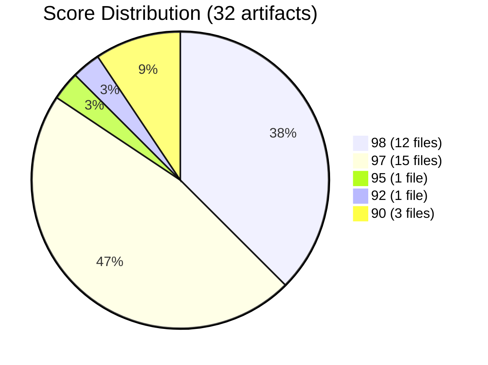
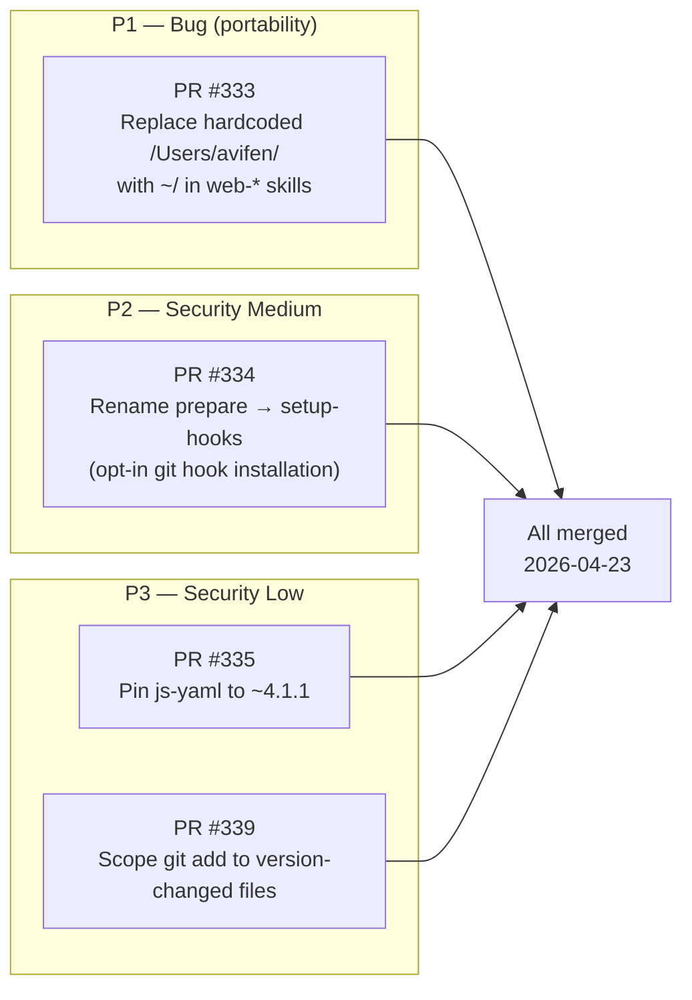
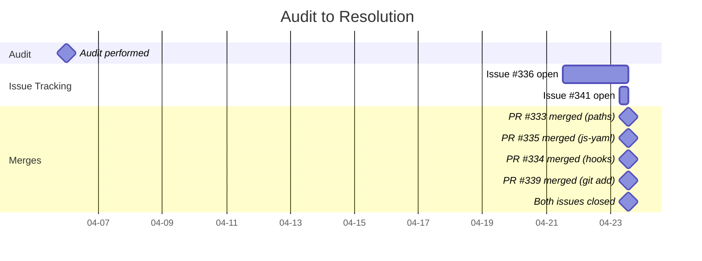

# Ninety-Seven Points and a Path That Breaks on Your Machine

> **Disclosure**: This article was generated by an automated pipeline using Claude (Sonnet 4.6) based on audit data and GitHub records. It describes work performed by NLPM tooling maintained by [xiaolai](https://github.com/xiaolai). Readers should weigh claims accordingly.

---

## The Project

[agent-sh/agentsys](https://github.com/agent-sh/agentsys) is an ambitious plugin collection for Claude Code and several other AI coding environments — OpenCode, Codex, Cursor, and Kiro. Its tagline: "AI writes code. This automates everything else." The repository bundles 19 plugins, 47 agents, and 40 skills into a single installable package maintained by [Avi Fenesh](https://github.com/avifenesh). With **752 stars** and 82 forks, it sits at the larger end of the NL artifact repositories in the NLPM auditor's discovery pool.

The breadth is the story: a project this large, with this many NL artifacts across multiple tool ecosystems, is where quality consistency is hardest to maintain. The audit tested whether that consistency held — the larger the ensemble, the harder it is to keep every part in tune.

---

## The Audit

**Date**: 2026-04-06 | **Artifacts**: 32 | **Strategy**: batched

The 32 audited artifacts cover the `.kiro/skills/` directory and key root configuration files. The repository's broader set of JavaScript source files, additional plugin manifests, and non-Kiro-target assets were scanned for security surface patterns but fall outside the NL quality scope.

**NL Score: 97/100** | **Security: CLEAR**

The distribution tells a clear story: 27 of 32 artifacts scored 97 or above. The remaining 5 form a tail from 90 to 95 — not failures, but files with a splinter or two worth pulling out. The overall 97/100 puts agentsys in the top tier of audited repositories and is a genuine reflection of the quality invested in the skill library.

**Score table (all 32 artifacts):**

| File | Type | Score | Top Issue |
|------|------|-------|-----------|
| `.kiro/skills/web-auth/SKILL.md` | Skill | 90 | Hardcoded developer path `/Users/avifen/.agentsys/` |
| `.kiro/skills/web-browse/SKILL.md` | Skill | 90 | Hardcoded developer path `/Users/avifen/.agentsys/` |
| `.claude-plugin/plugin.json` | Manifest | 90 | Non-NL artifact; minimal content |
| `CLAUDE.md` | Project memory | 92 | "Non-trivial changes" (Rule 4) is slightly vague |
| `meta/skills/maintain-cross-platform/SKILL.md` | Skill | 95 | ~1000 lines; recommended max 500 |
| `.kiro/skills/deslop/SKILL.md` | Skill | 97 | Clean |
| `.kiro/skills/consult/SKILL.md` | Skill | 97 | Clean |
| `.kiro/skills/enhance-hooks/SKILL.md` | Skill | 97 | Clean |
| `.kiro/skills/enhance-cross-file/SKILL.md` | Skill | 97 | Clean |
| `.kiro/skills/enhance-prompts/SKILL.md` | Skill | 97 | Clean |
| `.kiro/skills/enhance-docs/SKILL.md` | Skill | 97 | Clean |
| `.kiro/skills/enhance-orchestrator/SKILL.md` | Skill | 97 | Clean |
| `.kiro/skills/validate-delivery/SKILL.md` | Skill | 97 | Clean |
| `.kiro/skills/enhance-agent-prompts/SKILL.md` | Skill | 97 | Clean |
| `.kiro/skills/learn/SKILL.md` | Skill | 97 | Clean |
| `.kiro/skills/drift-analysis/SKILL.md` | Skill | 97 | Clean |
| `.kiro/skills/debate/SKILL.md` | Skill | 97 | Clean |
| `.kiro/skills/enhance-skills/SKILL.md` | Skill | 97 | Clean |
| `.kiro/skills/enhance-plugins/SKILL.md` | Skill | 97 | Clean |
| `.kiro/skills/enhance-claude-memory/SKILL.md` | Skill | 97 | Clean |
| `.kiro/skills/orchestrate-review/SKILL.md` | Skill | 98 | Minor: "typically indicates" (line 63) |
| `.kiro/skills/repo-intel/SKILL.md` | Skill | 98 | Minor: "for better analysis" |
| `.kiro/skills/perf-code-paths/SKILL.md` | Skill | 98 | Clean |
| `.kiro/skills/perf-benchmarker/SKILL.md` | Skill | 98 | Clean |
| `.kiro/skills/sync-docs/SKILL.md` | Skill | 98 | Minor: "better doc sync accuracy" |
| `.kiro/skills/perf-baseline-manager/SKILL.md` | Skill | 98 | Clean |
| `.kiro/skills/perf-analyzer/SKILL.md` | Skill | 98 | Clean |
| `.kiro/skills/perf-theory-gatherer/SKILL.md` | Skill | 98 | Clean |
| `.kiro/skills/discover-tasks/SKILL.md` | Skill | 98 | Clean |
| `.kiro/skills/perf-theory-tester/SKILL.md` | Skill | 98 | Clean |
| `.kiro/skills/perf-profiler/SKILL.md` | Skill | 98 | Clean |
| `.kiro/skills/perf-investigation-logger/SKILL.md` | Skill | 98 | Clean |

**Top issues by category:**

| Category | Count | Notes |
|----------|-------|-------|
| Hardcoded developer path | 2 | Same `/Users/avifen/` bug in both web-* skills — one root cause |
| Vague quantifiers | 3 | "Non-trivial", "typically", "better" — low-severity, informational |
| Oversized skill | 1 | maintain-cross-platform at ~1000 lines; recommended max 500 |

**Security summary:**

| Severity | Count |
|----------|-------|
| Critical | 0 |
| High | 0 |
| Medium | 3 |
| Low | 3 |

The security profile is typical for a developer-tooling package that installs itself into user home directories. No critical or high findings were present, so the CLEAR recommendation stood. The medium findings centred on the `prepare` lifecycle hook silently installing git hooks for direct cloners, and on `dev-install.js` writing to `~/.agentsys/` and `~/.claude/` outside the project root. Those home-directory operations were noted as expected installer behavior rather than surprises, and no PRs were raised for them.

---

## What Was Submitted

The audit produced two tracking issues and four PRs. The PR-level GitHub URLs are not available in the collected evidence (the PRs had already merged before the data snapshot was taken); they are referenced below by number as they appear in the merged commit messages.

**PR #333 — Replace hardcoded `/Users/avifen/` path** ([commit](https://github.com/agent-sh/agentsys/commit/d9e145d612d16ec8827af89bdfac6d7f30de5f8f))

Both `web-auth/SKILL.md` and `web-browse/SKILL.md` contained a developer-specific absolute path in every command example. The Codex install path receives a substitution transform at install time; the Kiro install path does not — it uses the SKILL.md source directly. The fix replaced every `/Users/avifen/.agentsys/` reference with the portable `~/` prefix.

**PR #334 — Move `prepare` to explicit `setup-hooks`** ([commit](https://github.com/agent-sh/agentsys/commit/f369ac41e1d7371530a4c0c3ffd11015623b645a))

npm's `prepare` lifecycle runs pre-publish and on direct git URL installs — it does not run when a package is fetched from the registry as a dependency. For direct cloners, this caused git hooks to be written silently without documentation. The practical risk was therefore limited to contributors cloning the repo, not to downstream consumers. The fix renamed the script to `setup-hooks`, documented it in CONTRIBUTING.md, and required contributors to opt in by running `npm run setup-hooks` after cloning.

**PR #335 — Pin js-yaml to `~4.1.1`** ([commit](https://github.com/agent-sh/agentsys/commit/df582c8508f3423fe32734958cecfd12c4e2159a))

The caret range `^4.1.1` is standard practice for well-maintained libraries, but it allows automatic minor version upgrades on install. The initial PR proposed an exact pin (`4.1.1`); after review the maintainer preferred a tilde range (`~4.1.1`) to let patch-level security fixes flow in automatically while blocking minor version changes. The package-lock.json root entry was also updated to match.

**PR #339 — Scope `git add` in version lifecycle** ([commit](https://github.com/agent-sh/agentsys/commit/8295196375286d2ca7ec4735f2e18bfd1e6bcd0e))

The `version` npm lifecycle script used `git add -A`, which staged all working-tree changes — not just the files touched by a version bump. Some projects use `git add -A` in version scripts intentionally to stage generated artifacts (changelogs, dist files); the fix's expanded allowlist attempts to preserve that intent while bounding the scope. The initial PR proposed staging only `package.json`; Copilot's review suggested expanding the allowlist to all files that a version bump actually writes (`package.json`, `package-lock.json`, `.claude-plugin/plugin.json`, `.claude-plugin/marketplace.json`, `site/content.json`). The merged commit uses that broader allowlist.

---

## The Response

agentsys is maintained primarily by Avi Fenesh and has been under active development throughout 2026; the same-day merge response reflects the project's active development cadence. All four PRs were merged on the same day — 2026-04-23 — within an 18-minute window — barely enough time to make a cup of tea. Both tracking issues were closed within seconds of each other at 13:29 UTC. The turnaround from issue creation to close was under 7 hours for issue #341 and roughly 48 hours for issue #336.

The maintainer did not rubber-stamp the submissions. Two of the four PRs received revisions before merge:

- **PR #335**: exact pin changed to tilde range. The commit message documents the reasoning explicitly: "Avi's preference: pin minor (block 4.2.x) but allow patches (4.1.x) so runtime security patches still flow in automatically." This is a defensible trade-off — the commit message suggests the maintainer understood the finding and chose a different point on the risk curve rather than dismissing it.

- **PR #339**: single-file stage broadened to full version-manifest allowlist, incorporating a Copilot review suggestion. The commit message credits both xiaolai (NLPM audit) and Copilot's review in the authorship chain, which is an accurate description of what happened.

PRs #333 and #334 merged without modification. The `prepare` → `setup-hooks` rename prompted a follow-up cleanup: the maintainer also removed a pre-commit placeholder hook that had been a no-op ("lib/ sync now handled by agent-core"), updated ARCHITECTURE.md to note the script is now manually invoked, and corrected an em-dash in CONTRIBUTING.md per a workspace style rule.

Co-authorship lines in the merged commits credit `claude[bot]`, `Claude Code`, `xiaolai`, and `Avi Fenesh` in combination — a readable record of the human-AI collaboration that produced the fixes, and a quiet acknowledgment that the diagnosis came from somewhere worth naming.

---

## What the Audit Revealed

**The hardcoded path is the canonical "works on my machine" bug in NL artifacts.** A skill file that embeds a developer's home directory path into command examples is a documentation accuracy issue — if Kiro executes the command examples at runtime, it breaks for every user who is not that developer; if Kiro treats them as AI reference text only, the absolute path is a portability smell rather than a runtime failure. The agentsys installer includes a path-substitution transform for the Codex target, suggesting portability was a known concern; the Kiro target appears to have been an oversight. This is exactly the kind of mechanical error that static analysis catches reliably — by nature, a developer-local path looks correct to the author. You don't notice the hole in your umbrella until it rains on someone else's machine.

**A 97/100 score does not mean "no bugs."** The scoring rubric measures NL quality — trigger clarity, frontmatter completeness, vague-word density, structural conventions. It does not execute the skills against a test matrix of user environments. The two web-* skills scored 90 not because of the path bug alone but because the path bug was the dominant issue; remove it and they would score 97 like their peers. The score correctly flagged the files as outliers. The gap between a 90 and a 97 is real signal.

**The security findings were proportionate.** Three medium findings in a package that deliberately installs itself into user home directories is not alarming — it is expected complexity for that class of tooling — a contractor who works in your home is going to leave traces. Two of the three medium findings (home-directory writes in `dev-install.js`) were noted as informational rather than submitted as PRs — an auditor judgment call, since the fix would require rearchitecting the installer rather than a mechanical change. The maintainer was not consulted on this prioritization and may have wanted the information surfaced.

**The `prepare` hook finding is worth generalizing.** npm's `prepare` lifecycle runs on direct git URL installs and pre-publish — not when the package is installed as a registry dependency. Any package that uses `prepare` to write files to `.git/hooks/` — without checking `if [ -d .git ]` — will modify the git state of whatever project installs it — the git equivalent of a houseguest who rearranges the kitchen drawers while making coffee. The agentsys script did include the directory check, so the practical risk was limited to direct cloners; but the documentation did not explain this, which is what the finding flagged.

---

## Timeline

The audit ran on April 6. The first issue appeared April 21 — a 15-day gap reflecting the auditor pipeline's batch-processing schedule: audit outputs queue for batch triage before issues are created. All merges completed on April 23, with the entire merge sequence finishing in 18 minutes.

---

## Limitations

The audit scored NL quality and scanned for security patterns in static files — it reads the recipe, not the meal. It did not:

- Execute the skills in a real Kiro or Claude Code environment to confirm the hardcoded path actually failed at runtime (the failure mode is deterministic and the fix is correct, but end-to-end testing was not performed).
- Assess whether the `dev-install.js` home-directory writes are safe in practice — only that they represent an elevated-privilege surface worth documenting.
- Evaluate the 23 JavaScript files in `scripts/` for logic correctness, only for security surface patterns.
- Check whether the eight perf-* skills form a pipeline that works end to end; their coherence was assessed by reading cross-references, not by running them.
- Have access to PR review threads at the time of data collection. Reviewer comments in the commit messages are the only evidence of the review conversation.

The 97/100 score is a point-in-time measurement of the audited artifact set on the audit date. Three of the four bugs fixed post-audit were in `package.json` and JavaScript files that are not NL artifacts and therefore not reflected in the NL score. `.claude-plugin/plugin.json` was included in the 32-artifact count and scored at 90; it is a manifest rather than a NL artifact in the strict sense, but it was audited as part of the full artifact set. The aggregate 97/100 rounds the same whether this file is included or excluded.

---

## Significance

agentsys is one of the more mature NL artifact repositories in the auditor's discovery pool. The 97/100 score is earned: 27 of 32 skills have complete frontmatter, clear trigger phrases, and no vague-quantifier issues. The perf-* pipeline of eight skills maintains consistent cross-references and defers to a canonical contract document — that kind of structural discipline across a multi-file subsystem is uncommon.

The hardcoded path bug is a reminder that high aggregate scores can coexist with concrete portability issues in specific files — a map can be 97% accurate and still send you to the wrong address. The audit flagged the bug; the maintainer fixed it two days after the issue was filed. That is the intended outcome.

The maintainer's decision to modify two PRs before merging — changing an exact pin to a tilde range, expanding a file allowlist based on a Copilot review — reflects informed engagement with the underlying trade-offs rather than passive acceptance. It is a better outcome than either rejection or unreviewed merge.

Four PRs merged, two issues closed, zero regressions reported — the whole thing tidied up before lunch.
