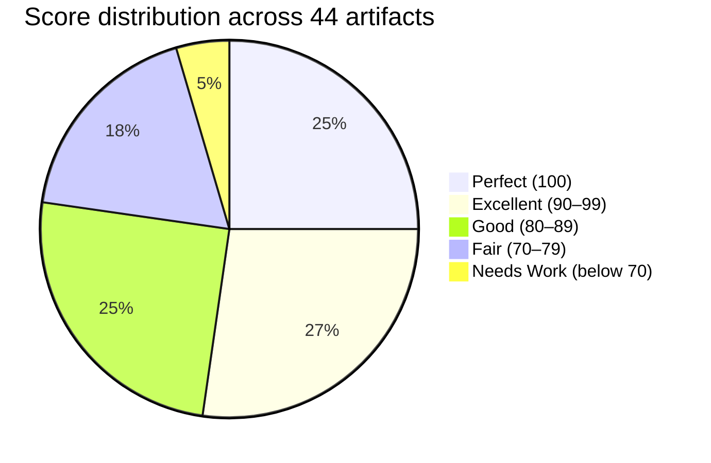
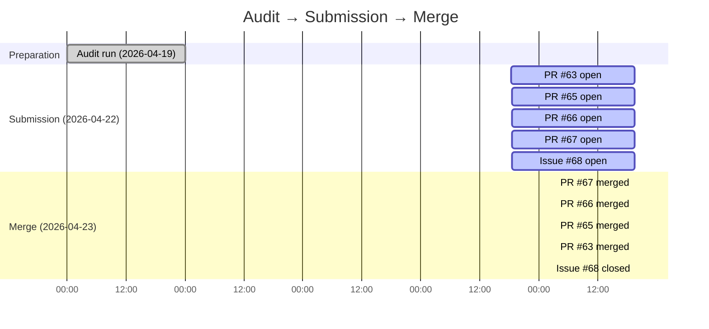

# When the Reference Repo Has Bugs: Auditing Claude Code Best Practice

> **Disclosure**: This article was generated by an automated pipeline using Claude (Sonnet 4.6) based on audit data and GitHub records. It describes work performed by NLPM tooling maintained by [xiaolai](https://github.com/xiaolai). Readers should weigh claims accordingly.

## The Project

[shanraisshan/claude-code-best-practice](https://github.com/shanraisshan/claude-code-best-practice) is maintained by [Shayan Rais](https://github.com/shanraisshan) and describes itself as a journey "from vibe coding to agentic engineering — practice makes Claude perfect." With 47,637 stars and 4,691 forks, it is one of the most widely-referenced collections of Claude Code patterns on GitHub — the kind of repo developers forward to teammates the same week they discover it. The repo includes a full agent-team system, multi-timezone time agents, weather orchestration, presentation automation, and a detailed development-workflows tracker — all built with Claude Code's native primitives (commands, agents, skills, hooks, and MCP servers).

## The Audit

NLPM audited 44 NL artifacts on 2026-04-19 and returned an overall score of **88/100**. The security scan came back **CLEAR** — no Critical or High findings. 88/100 reflects strong conformance on structural rules; the gap is concentrated in two mechanical patterns.

The split tells a consistent story: skills and hook configs are uniformly perfect (every one of the 10 skills and 2 hook configs scored 100), while agents drag the average down. The weakest artifact was the root `.claude/agents/time-agent.md` at 57 — a single-purpose agent that runs one `date` command but declares 10+ tools including `Write`, `Edit`, `WebFetch`, `WebSearch`, and `Agent` — like a night watchman who insists on carrying a full tool belt.

**Top issues by type:**

| Category | Finding | Affected artifacts |
|----------|---------|-------------------|
| No usage examples | Systematic gap — zero examples across all 20 agents | 20 agents |
| Read-only agents with mutation tools | Body says "do not modify files" but `allowedTools` includes `Write`/`Edit` | 7 agents |
| Missing `allowed-tools` frontmatter | All 8 standalone commands omit this field | 8 commands |
| Vague quantifiers | "appropriate", "relevant" without concrete criteria | 7 files |
| Unused `NotebookEdit` | Declared but no notebook editing task exists | 4 agents |

The 88/100 score is fair. The repo excels at structure, naming, and skill quality. The penalties are concentrated in two mechanical patterns — missing examples and permission-list mismatches — that are fixable without rethinking the design — the best kind of fixable.

## What Was Submitted

The audit surfaced 2 bugs and 4 security findings. NLPM submitted 4 PRs, prioritizing the bugs and the two security fixes at Medium severity.

**Bug fixes:**

- [PR #63](https://github.com/shanraisshan/claude-code-best-practice/pull/63) — `fix: add missing description frontmatter to time-orchestrator command`
  The `agent-teams/.claude/commands/time-orchestrator.md` had only `model: haiku` in its YAML frontmatter — no `description` field. Without a description field, Claude Code displays the command with no summary label in the slash-command menu, making it harder to distinguish from other commands. One line added — but it is the line that tells users which door to open.

- [PR #65](https://github.com/shanraisshan/claude-code-best-practice/pull/65) — `fix: rename root time-agent to time-agent-pkt to resolve name collision`
  Two agent files both declared `name: time-agent` with different implementations: the root agent serves PKT/UTC+5, the `agent-teams` variant serves Dubai GST/UTC+4. In sessions where both scopes are active simultaneously, Claude Code's resolution behavior could invoke the wrong agent, silently serving the wrong timezone; in normal project-scoped sessions this may not occur. NLPM renamed the root agent to `time-agent-pkt` and noted that `time-command.md` references it. Two agents sharing one name: the repo equivalent of two employees answering the same extension.

**Security fixes:**

- [PR #66](https://github.com/shanraisshan/claude-code-best-practice/pull/66) — `fix: add hooks log directory to .gitignore to prevent sensitive data leakage`
  `hooks.py` logs full hook event data — including `tool_input`, which may contain file contents or command arguments — to `.claude/hooks/logs/hooks-log.jsonl`. This file was not excluded from git, creating a risk of accidentally committing sensitive data. PR adds `.claude/hooks/logs/` to `.gitignore`.

- [PR #67](https://github.com/shanraisshan/claude-code-best-practice/pull/67) — `fix: pin MCP server package versions to prevent supply-chain drift`
  All three MCP servers in `.mcp.json` used `npx -y <package>` without version pins, causing npx to auto-install the latest version on each invocation. Pinned to stable versions verified against the npm registry: `@playwright/mcp@0.0.70`, `@upstash/context7-mcp@2.1.8`, `deepwiki-mcp@0.0.6`.

The two remaining security findings (subprocess path resolution for the audio player binary, Low severity) were left as informational — the current sanitization was assessed as adequate mitigation. The risk is that unsanitized subprocess paths could allow path traversal or injection; users with untrusted input paths should verify the existing input validation is sufficient for their deployment.

## The Response

No PR review comments exist in the evidence — a quiet acknowledgment that the diffs arrived pre-reviewed. Shayan Rais merged all four PRs in a single session approximately 25 hours after submission, in rapid succession:

| PR | Merged at (UTC) |
|----|----------------|
| #67 (MCP pins) | 2026-04-23 19:22:09 |
| #66 (gitignore) | 2026-04-23 19:22:35 |
| #65 (agent rename) | 2026-04-23 19:24:00 |
| #63 (description) | 2026-04-23 19:24:36 |

The tracking issue ([#68](https://github.com/shanraisshan/claude-code-best-practice/issues/68)) was closed 7 minutes after the last merge — enough time to scan the thread once and decide it was done. The pattern suggests the maintainer reviewed the diffs directly without leaving inline comments — a common merge style for small, mechanical fixes. We cannot rule out that the diffs were merged without per-line review; a 2.5-minute window across 4 PRs is fast even for mechanical fixes.

The same session also included unrelated maintenance commits (drift-tracking logs, README table updates, a mascot SVG addition), all co-authored by Claude. The maintainer is running their own Claude-assisted maintenance pipeline in parallel with external contributions. Issue #68 was opened one minute after the last PR submission, serving as a tracking issue rather than a pre-PR heads-up; no prior contact with the maintainer is recorded in the evidence.

## What the Audit Revealed

**Agents in this repo follow a consistent pattern:** commands orchestrate agents, agents call skills, and skills hold the reference knowledge. That architecture is sound. The quality issues are surface-level — they do not indicate a design problem. They indicate that the tooling for writing agents (examples, permission lists) was not the focus when the repo was built. The discrepancy between body instruction and tool list may also be intentional — the body constraint is a behavioral nudge, while the broad tool list preserves user flexibility.

**The skills are notably clean.** Every skill file scored 100. This is uncommon in practice — like finding every footnote in a textbook correct — and reflects deliberate effort. It also validates the skill-first architecture: the knowledge layer is precise, even when the agent layer around it is noisy.

**The name collision bug is the most interesting finding.** Two independently-written agents both chose the same name (`time-agent`) for different purposes. This is a natural failure mode when a repo grows by adding nested scopes (root, `agent-teams/`, `development-workflows/rpi/`) without a naming convention that encodes scope. The fix is mechanical — a rename — but the root cause is organizational: a repo that grew by adding new rooms without a convention for putting names on the doors.

**Fairness note:** most of the quality penalties (−15 per agent for no examples, −5 per command for no `allowed-tools`) are mechanical checklist items. A 94/100 agent like `requirement-parser.md` loses points for vague quantifiers like "relevant" appearing twice — NLPM's rules flag these as a systematic risk, but in some agents this flexibility may be the intended design. The 88/100 score reflects conformance to NLPM's rules, not a judgment about whether the repo is useful. It clearly is. NLPM arrived with a checklist; the repo arrived with a community. NLPM did not submit PRs for scoring-penalty issues; these may reflect intentional design choices rather than oversights.

## Timeline

From audit to all PRs merged: approximately 4 days. Submission to merge: approximately 25 hours.

## Limitations

- **No review comments in evidence.** We do not know whether Shayan reviewed the diffs carefully or spot-checked them. Merge speed alone does not prove quality acceptance.
- **prs.json was empty.** PR URLs were reconstructed from merge commit messages in commits.json. The PR links are accurate but the submission metadata (PR descriptions, labels) was not captured.
- **No pr-*-reviews.json files existed.** We cannot characterize maintainer feedback beyond the merge event.
- **Score does not measure runtime behavior.** NLPM scores structural conformance. Whether the name-collision bug caused actual runtime errors in Shayan's own sessions is unknown.
- **None of the 17 quality-scoring issues were addressed by these PRs.** NLPM submitted fixes for bugs and Medium/Low security issues only. The quality issues (missing examples, read-only agents with mutation tools, missing `allowed-tools`) remain. The 88/100 score is unchanged by these PRs in isolation — the merged fixes address bugs and security, not the scoring penalties.

## Significance

This engagement confirms that even well-maintained, widely-referenced repos carry mechanical bugs that automated audit can catch. A missing `description` field silently breaks command discovery — you find the gap the way you find a hole in your umbrella, only when it rains. A name collision silently routes commands to the wrong agent. An unpinned `npx -y` silently exposes users to supply-chain risk.

What is notable here is the maintainer's operating cadence. Shayan Rais is running a live drift-tracking system — daily commits syncing documentation, badge timestamps, and table updates — co-authored by Claude. In this session, the repo showed signs of active maintenance — drift-tracking logs, README updates, and a mascot addition, all co-authored by Claude. Four external PRs merged in 2.5 minutes, with the tracking issue closed 7 minutes later, fits the behavior of a maintainer who reviews mechanically-generated diffs with practiced efficiency.

### Implications

None of these required judgment to find — they are pattern matches against known failure modes. The 47,637-star audience means that the MCP version-pinning fix and the gitignore addition propagate to a large number of users who fork or copy these patterns. That is the multiplier that makes automated audit worthwhile on repos like this one.

This case study was written because all four PRs were accepted. Case studies from repos where PRs were rejected or ignored would present a different picture. Consider this the optimistic chapter.
