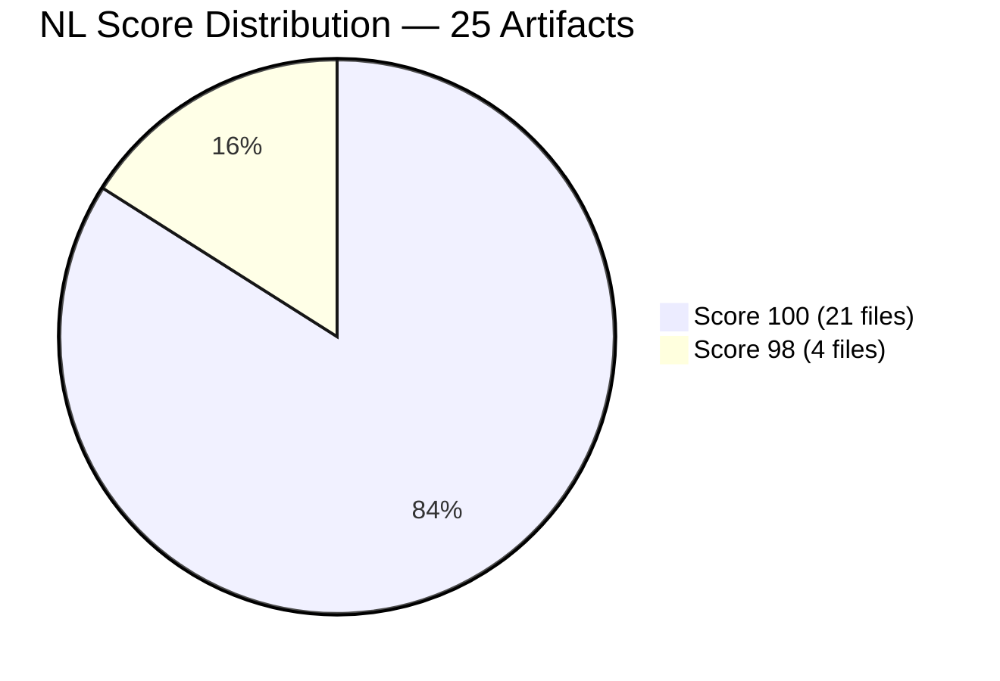
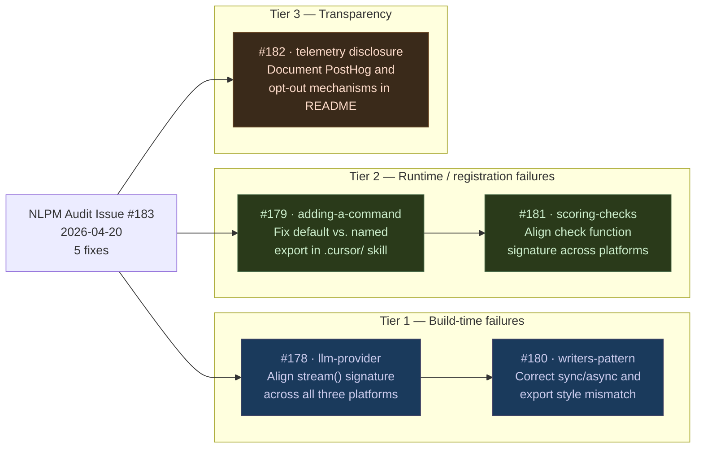
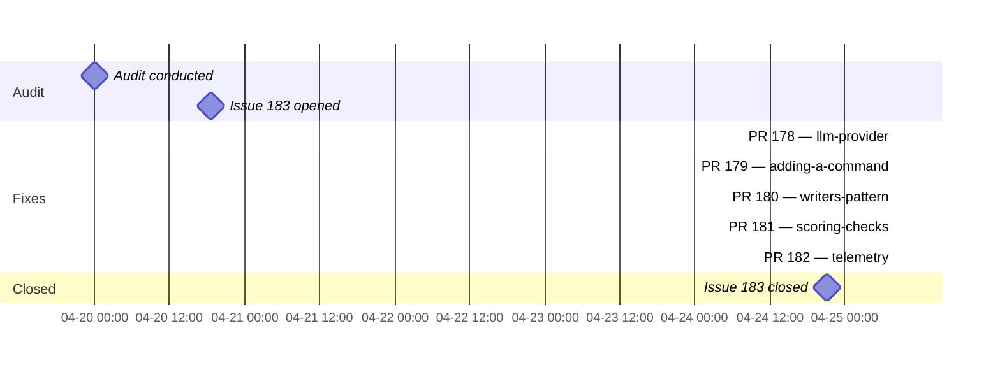

# Fluently Wrong: How Platform Drift Outran a 100/100 NL Score

> **Disclosure**: This article was generated by an automated pipeline using Claude (Sonnet 4.6) based on audit data and GitHub records. It describes work performed by NLPM tooling maintained by [xiaolai](https://github.com/xiaolai). Readers should weigh claims accordingly.

---

## The Project

[caliber-ai-org/ai-setup](https://github.com/caliber-ai-org/ai-setup), maintained by [Caliber](https://github.com/caliber-ai-org), does what its description says in one sentence: continuously sync your AI setups with one command. It generates platform-specific skill files for Claude Code, Cursor, and Codex from a single codebase, deploying the same conceptual skills to each tool's native format — the same song arranged for three different instruments. At the time of audit, the repository had 737 stars and 94 forks — a meaningful signal of adoption among developers who work across multiple AI coding environments.

The multi-platform output model is the project's core value proposition. It is also, as the audit discovered, the source of its most consequential defects — the place where "generate once, deploy everywhere" meets "who updates the copies?"

---

## The Audit

NLPM audited 25 artifacts on 2026-04-20 and scored the repository at **100/100** — an uncommon result in NLPM's audit history at the time of this engagement, for a project of this complexity. All 25 artifacts either met or exceeded expectations for structure, precision, and register.

The four files at 98 all carried the same deduction: the word *"appropriate"* appeared without a decision rule, as in "add constants below the **appropriate** category section" or "refine the instruction with an **appropriate** type prefix." These are the smallest actionable issues the scorer can flag — a two-point deduction per instance (per NLPM's vague-quantifier penalty rule) — because an agent reading the skill still needs to guess which category applies. For the other 21 files, no deductions applied.

**The NL quality score, however, does not evaluate technical accuracy.** It evaluates whether instructions are clear, complete, and unambiguous in the language they use. A skill that fluently describes the wrong function signature scores 100/100 on NL quality. That is exactly what happened here: impeccable prose, incorrect interfaces.

### Bugs

All four bugs shared the same root cause: the same eight skill types are deployed to three platforms (`.claude/`, `.agents/`, `.cursor/`), but four of those skills had diverged to describe incompatible TypeScript interfaces. This audit treats these skills as agent-consumed artifacts; if they serve primarily as human developer reference, the impact of interface mismatches would be lower and may not manifest as runtime failures.

| Skill | Divergence | Consequence |
|---|---|---|
| `llm-provider` | `.agents/` uses `AsyncGenerator<string>`; `.cursor/` uses `AsyncIterable<StreamChunk>`; `.claude/` matches `src/llm/types.ts` callback-based interface | Two of three platform copies produce provider implementations that fail type checking at build time |
| `writers-pattern` | `.agents/` is async with two params; `.cursor/` is async with a different name; `.claude/` is synchronous named export | Two of three produce writers that fail at runtime when orchestrated by `writeSetup()` |
| `adding-a-command` | `.cursor/` specifies a default export; `.claude/` and `.agents/` specify named exports | Cursor-following agents generate command files that fail to register in `src/cli.ts`, which expects named imports |
| `scoring-checks` | Three incompatible signatures: `dir: string` (`.claude/`), `ScoringContext` (`.agents/`), two-param named export (`.cursor/`) | Two of three produce check functions that fail to register in `src/scoring/index.ts` |

The four "stable" skills — `save-learning`, `find-skills`, `setup-caliber`, `caliber-testing` — were consistent across all three platforms and well-authored throughout.

The audit identified a likely root cause: the platform-specific skills appear to have been independently authored or updated at different times, rather than generated from a single source of truth — like three musicians working from separate transcriptions of the same recording — though NLPM has no access to git history to confirm this directly. The `.claude/` versions are the most detailed and align most closely with the documented architecture. The `.agents/` versions are condensed summaries. The `.cursor/` versions appear to describe a different internal API shape entirely.

**Important caveat**: this analysis treats `.claude/` and `src/llm/types.ts` as ground truth. The `.cursor/` interface differences may reflect deliberate platform adaptation rather than drift — Cursor's extension runtime may legitimately expect different streaming or async patterns, and `AsyncIterable<StreamChunk>` could be a correct description of how Cursor's runtime works. The audit concluded these were unintentional divergences because the `.cursor/` versions carried no annotation suggesting intentional platform targeting, but this cannot be confirmed without maintainer input. If any of the four findings turn out to be valid platform adaptations, they are features rather than bugs.

### Security

The security scan returned no Critical or High findings. Two Medium and two Low findings were logged:

| Severity | Finding |
|---|---|
| Medium | `posthog-node` production dependency transmits CLI usage to PostHog servers; no disclosure in README or `caliber init` output |
| Low | `"prepare": "husky"` runs on every `npm install`, modifying `.git/hooks/` on user machines (standard Husky install pattern; flagged for completeness) |
| Low | 22 production and dev dependencies use `^` version ranges; supply-chain drift possible on minor/patch bumps (standard npm practice; flagged for completeness) |
| Low | `scripts/postinstall.js` is executable but not wired into `package.json` scripts — dead code with a confusing name |

---

## What Was Submitted

The formal PR tracking log (`prs.json`) contains no entries for this engagement. The merge commit log records five pull requests co-authored by the NLPM tooling and merged into `caliber-ai-org/ai-setup` on 2026-04-25:

**PR #178** — [commit 9a46fd4](https://github.com/caliber-ai-org/ai-setup/commit/9a46fd43952233236425e5e8b38b896675706549): Aligned the `LLMProvider.stream()` signature across all three platform copies to match the callback-based interface defined in `src/llm/types.ts`. Both `.agents/` and `.cursor/` had described generator/iterable patterns that do not exist in the source.

**PR #179** — [commit a734716](https://github.com/caliber-ai-org/ai-setup/commit/a734716c3727b809c0873e026e6ca403c091441d): Corrected the `.cursor/` version of `adding-a-command` from a default export to a named export, matching the pattern in `.claude/`, `.agents/`, and the actual import style in `src/cli.ts`.

**PR #180** — [commit 1eec969](https://github.com/caliber-ai-org/ai-setup/commit/1eec969e5dbd25c9846a23a1eab248c4046a662c): Updated `.agents/` and `.cursor/` `writers-pattern` skills to document the correct synchronous named-export pattern (`write{Platform}Config(config): string[]`) matching `src/writers/claude/index.ts`.

**PR #181** — [commit 203da12](https://github.com/caliber-ai-org/ai-setup/commit/203da129c6bb7697cb53cf61c3170860a4485c85): Corrected the check function signature in `.agents/` and `.cursor/` scoring-checks skills. Both had described context-object and two-param patterns; the actual check functions take a `dir: string` path and call `existsSync`/`readFileSync` directly.

**PR #182** — [commit 3a7f16a](https://github.com/caliber-ai-org/ai-setup/commit/3a7f16a1d27e2f8f5403dd4b899da9d06b084e38): Added PostHog disclosure and both opt-out mechanisms (`--no-traces` CLI flag, `CALIBER_TELEMETRY_DISABLED=1` env var) to the README FAQ, addressing the Medium-severity telemetry finding.

One additional commit from before the audit — [commit 7370d1e](https://github.com/caliber-ai-org/ai-setup/commit/7370d1ead1e6085d29784545af41f0a7965d153d) (2026-04-16, PR #145, surfacing skill generation failures via `onError`) — co-authored by Claude but predates issue #183 and is not attributed to this audit engagement.

---

## The Response

No formal PR review comments were recorded in the evidence for this engagement. The five commits all carry `Co-authored-by: claude[bot]` and `Co-authored-by: Claude Code`. Whether changes were accepted as-is, modified in merge, or informally discussed via other channels is unknown — the absence of recorded comments is not evidence that none occurred.

The tracking issue ([#183](https://github.com/caliber-ai-org/ai-setup/issues/183)) was created on 2026-04-20 and closed on 2026-04-24, four days later, before the five commits landed on 2026-04-25. Why it closed on 2026-04-24 is unexplained by available evidence: the PR tracking log is empty for this engagement, so the mechanism (auto-close from a PR merge, manual close, or other trigger) cannot be determined.

The audit's suggested approach — elect one platform version as authoritative (most likely `.claude/`), verify it against the source files, then regenerate the other copies — appears to have been the approach taken. All five commits describe exactly this pattern: reading the `.claude/` version as ground truth, comparing against the TypeScript source, and updating `.agents/` and `.cursor/` to match.

---

## What the Audit Revealed

The central finding is a structural tension in any multi-platform documentation strategy: **three copies of the same truth will drift unless a synchronization mechanism enforces consistency** — the documentation equivalent of a game of telephone, played slowly, across three platforms.

The caliber-ai-org/ai-setup project generates platform-specific skill files as a core feature. The audit found that four of eight skill types had diverged in technically significant ways across platforms — not in style or emphasis, but in the fundamental TypeScript interfaces they described. An agent following the `.cursor/` version of `writers-pattern` would write async code that the `.claude/` version would reject as wrong, and vice versa.

The four "stable" skills were likely those that described more stable, less-frequently-modified surface area. The four divergent skills — `llm-provider`, `scoring-checks`, `adding-a-command`, `writers-pattern` — all describe active integration points in the codebase (the LLM abstraction layer, the scoring system, the CLI command registration, and the writer orchestration). These are the surfaces most likely to evolve, and therefore most likely to accumulate drift — you find the hole in the umbrella when it rains.

**Fairness note**: The skills are individually well-written and nearly all score 100/100 on NL quality — a genuine achievement for a project of this scope. The bugs are not evidence of careless authorship; they are evidence that cross-platform synchronization is a hard problem that requires either tooling or process to solve reliably. The four vague-quantifier quality issues are minor — two points each — and the kind of second-draft fix that any careful edit would catch. The divergence across platform copies is consistent with rapid development — a codebase where documentation trails an active feature surface across multiple output targets.

---

## Timeline

*Note: Issue #183 closed on 2026-04-24 21:06 UTC; the five fix commits landed on 2026-04-25 07:57–08:00 UTC — all within a 3-minute window — five fixes, three minutes, no record of a debate — consistent with batch or auto-merge rather than individually reviewed PRs. Why the issue closed on 2026-04-24, before these commits landed on 2026-04-25, is unexplained by available evidence: the PR tracking log (prs.json) is empty for this engagement, so it is not possible to identify which PR (if any) triggered GitHub's auto-close or when it was merged.*

---

## Limitations

- **No PR review data**: No review comments were captured for this engagement. The maintainer's reasoning for accepting or modifying any of the proposed changes is not available.
- **Post-merge re-audit was skipped for this engagement**; before/after quality change is not independently verified. Whether the merged changes accurately fix the diagnosed divergence — or introduce new inconsistencies — has not been confirmed by a second scoring pass.
- **prs.json tracking gap**: The formal PR tracking log for this engagement is empty, even though commit evidence shows five PRs were merged. The evidence base for "what was submitted" relies on commit messages rather than the primary tracking artifact.
- **Commit hashes are unverified**: Commit hashes cited in "What Was Submitted" are sourced from the merge commit log; NLPM did not independently verify their content against the live repository.
- **Single-snapshot audit**: The audit reflects a point-in-time state (2026-04-20). The codebase may have evolved before or after in ways not visible here.
- **NL score measures language quality, not technical correctness**: A 100/100 NL score confirms that instructions are well-formed, unambiguous, and complete in prose. It does not confirm that the TypeScript interfaces described are accurate. This engagement is a concrete demonstration of that distinction.

---

## Significance

caliber-ai-org/ai-setup is a rare case where the NL quality audit found essentially nothing to criticize in how the skills were written — and still surfaced four bugs that could break builds, fail deployments, and confuse agents in ways that are difficult to diagnose.

The lesson is not that NL quality scores are misleading. It is that they measure what they claim to measure: language precision, structural completeness, and the absence of vague instructions. Technical accuracy is a separate dimension that requires cross-referencing skill content against authoritative source files. Catching this class of bug requires comparing platform copies against each other, not per-file analysis — the per-file NL scores could not have flagged it.

This engagement assumes skills describe the current source interface. If skills are forward-looking specifications or platform-specific targets, the cross-component check requires a different ground truth — one defined per-platform rather than by the `.claude/` copy or `src/` types.

For repositories that deploy the same knowledge base across multiple AI platforms, this engagement suggests a concrete process requirement: a synchronization check that compares platform copies against a designated source of truth and flags divergence before it accumulates. The `.claude/` skills in this project were accurate; the others had drifted. Without a diff-based gate, the drift is invisible until an agent produces wrong code.

The more durable contribution may be the diagnostic pattern: when the same skill appears in three places and scores 100/100 in each, look harder at whether all three describe the same thing. The quick merge rate likely reflects the mechanical nature of the fixes — each PR addressed a specific interface mismatch — rather than the project's overall review velocity. The NL scorer can tell you the instructions are unambiguous. Only the compiler can tell you they are true.
