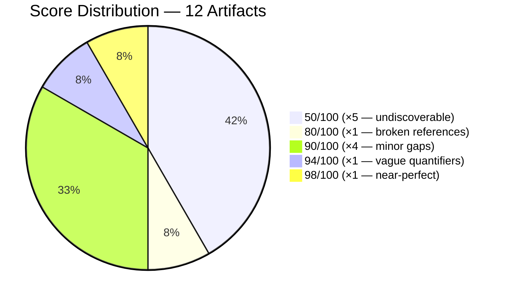
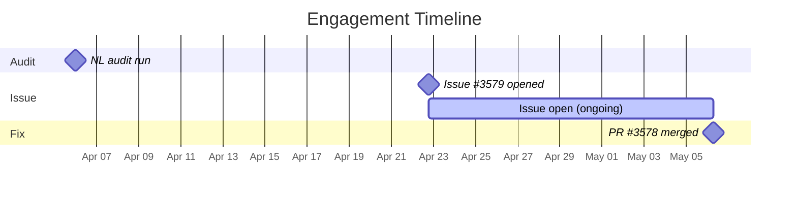

# The Framework That Forgot to Name Its Own Agents

> **Disclosure**: This article was generated by an automated pipeline using Claude (Sonnet 4.6) based on audit data and GitHub records. It describes work performed by NLPM tooling maintained by [xiaolai](https://github.com/xiaolai). Readers should weigh claims accordingly.

## The Project

oh-my-openagent bills itself as "the best agent harness." With 56,047 stars and 4,564 forks on GitHub, it is not a modest claim — and not an inaccurate one. The project, formerly known as oh-my-opencode, is maintained by [YeonGyu-Kim](https://github.com/code-yeongyu) and ships a full-featured runtime for orchestrating AI agents, complete with built-in skills, hook infrastructure, and a plugin-style architecture for extending agent behavior.

At this scale, the codebase is clearly well-tended. The skills in `.opencode/skills/` show careful structuring and real operational depth. That makes the audit's central finding all the more striking — like finding an immaculately maintained workshop where four of the tools have no labels.

## The Audit

NLPM scored oh-my-openagent on 2026-04-06 across 12 NL artifacts. The overall score was **74/100** — above the default quality threshold of 70, but not by much, and for a specific reason.

Five artifacts scored 50/100. Four of them were `AGENTS.md` documentation files under `src/agents/` and its subdirectories (`hephaestus/`, `prometheus/`, `sisyphus/`). The fifth was a TypeScript compiler config (`src/hooks/atlas/tsconfig.json`) that is not an NL artifact at all and should not have been in the scan list.

The four AGENTS.md files share a single root cause: they appear to be auto-generated documentation summaries — each carries a `**Generated:** 2026-04-xx` header, indicating automated output — and none include YAML frontmatter (`name`, `description`). Without that frontmatter, NL tooling cannot register or index them. They score 50 by convention for missing the most basic structural requirement (the `name`/`description` frontmatter penalty).

The remaining seven skills tell a different story. The highest-scoring artifact, `src/features/builtin-skills/git-master/SKILL.md`, reached 98/100 — docked only two points for a single vague qualifier ("suitable") in Phase 4.1. Three `.opencode/skills/` files and two `src/features/builtin-skills/` files scored 90/100. The gap between 50 and 90+ is not organic unevenness; it maps directly onto a process gap: human-authored skills got careful attention, auto-generated documentation did not — the machine that writes the docs doesn't know to sign its own name.

**Top issues by impact:**

| # | File | Score | Root Cause |
|---|------|-------|------------|
| 1–4 | `src/agents/*/AGENTS.md` | 50 | No YAML frontmatter; auto-generated without metadata |
| 5 | `src/features/builtin-skills/dev-browser/SKILL.md` | 80 | Two broken cross-references to non-existent files |
| 6–8 | Three skill files | 90 | Missing `output:` format declarations |
| 9 | `pre-publish-review/SKILL.md` | 94 | Vague thresholds ("significant findings", "minor issues") |

The security scan returned no Critical findings. One High-severity finding was flagged: `postinstall.mjs` runs `execSync("opencode --version")` as a subprocess during `npm install`. The command is hardcoded and benign — this is standard practice for binary npm packages like esbuild and Prisma — but the structural pattern constitutes a supply-chain risk surface. Two Medium findings covered a self-authored `trustedDependencies` entry (`@code-yeongyu/comment-checker`) and the presence of `posthog-node` telemetry without documented opt-out. One Low finding noted unpinned semver ranges across production dependencies.

## What Was Submitted

The automated PR pipeline did not produce a formally tracked PR record for this engagement. However, the merge commit visible in the target repo's git log confirms that a PR was opened from the branch `xiaolai/fix/nlpm-agents-missing-frontmatter` and merged on 2026-05-06:

- **Merge commit**: [`44216a5`](https://github.com/code-yeongyu/oh-my-openagent/commit/44216a538e3272fa23dd5edbeca6fee953db5717)
- **Commit message**: `docs(agents): add YAML frontmatter to AGENTS.md documentation files`
- **Merged**: 2026-05-06T06:44:57Z

This directly addresses the primary score driver: all four auto-generated `AGENTS.md` files gained `name` and `description` frontmatter, making them discoverable by NL tooling. The fix was the change with the largest projected impact on the aggregate score — correcting four 50/100 scores in a single commit.

A tracking issue was also opened: [#3579 — "NLPM audit: NL artifact quality report (score 74/100)"](https://github.com/code-yeongyu/oh-my-openagent/issues/3579), created 2026-04-22. As of the writing date (2026-05-06), the issue remains open, covering the remaining quality and security findings.

The secondary bugs in `dev-browser/SKILL.md` (two broken cross-references to `references/installation.md` and `references/scraping.md`) and the Medium/Low security findings were not addressed in the merged PR. They remain open items in issue #3579.

## The Response

The maintainer merged the frontmatter fix without modification. The branch naming convention (`fix/nlpm-agents-missing-frontmatter`) and conventional-commits message format (`docs(agents):`) match the project's existing commit style, which likely eased review friction.

No review comments are recorded in the evidence for this engagement, and no statement was obtained from the maintainer — the commit log is, as usual, the most candid witness. The merge itself — fourteen days after the tracking issue was opened — is the observable signal; interpreting it as acceptance of the fix is an inference.

The tracking issue remaining open may indicate the maintainer is aware of the broader findings; no activity was recorded on the issue between its creation date and the writing date.

## What the Audit Revealed

**Auto-generation creates a documentation gap.** The four AGENTS.md files are generated summaries, not hand-authored docs. The generation process produced valid Markdown but skipped the YAML frontmatter block — the single most important structural element for NL tooling. This is a recognizable pattern: tooling that writes fluent prose for human readers but forgets to address the envelope for the tools that will also need to find it. Adding frontmatter to the output files is a one-line change per file, but a permanent fix likely requires updating the generation script. If the generation script reruns without preserving frontmatter, the fix will regress — patching the output without patching the source is less a fix than a sticky note on the symptom.

**Two distinct skill populations with different quality profiles.** The `.opencode/skills/` orchestration skills (github-triage, work-with-pr, pre-publish-review) and the `src/features/builtin-skills/` reference skills (agent-browser, dev-browser, git-master, frontend-ui-ux) are clearly authored by different processes or at different times. The orchestration skills show more structural completeness; the reference skills more often omit `output:` declarations — though whether this reflects oversight or intentional design for skills intended for human reference use only is not determinable from the audit alone. Neither group has structural contradictions between them.

**Broken references are a planning artifact.** `dev-browser/SKILL.md` references `references/installation.md` and `references/scraping.md`, neither of which exists anywhere in the repository. These were likely planned companion docs that were never written, or were deleted after the skill was authored — exits marked on the map for roads that were never paved. The skill scores 80/100 as a result — a meaningful penalty for something that would take one afternoon to fix.

**Security posture is conventional, not alarming.** The postinstall subprocess is the most structurally significant security finding, but it is not unusual for binary npm packages. The `@code-yeongyu/comment-checker` trustedDependency and the unpinned dependency ranges are worth documenting but not urgent. No exploitable vulnerability was found.

A fairness note, and it deserves one: the tsconfig.json inclusion inflated the artifact count by one and assigned it a 50/100 score it cannot meaningfully carry. Excluding it from a re-score would shift the denominator from 12 to 11, which would raise the overall weighted average slightly. The NLPM scanner's inclusion of non-NL configuration files in the scan list is a known false-positive class.

## Timeline

## Limitations

- Post-merge re-audit was skipped for this engagement; before/after quality change is not independently verified. The expected improvement from adding frontmatter to four 50/100 artifacts is calculable (the weighted average should rise from 74 to approximately 83, assuming fixed files score ~80, the next most common penalty tier), but this is a projection, not a measurement.
- No PR review comments were captured for this engagement. The merge-without-comment record reflects the available evidence; the maintainer may have reviewed and communicated through other channels.
- The prs.json tracking file is empty despite evidence that PR #3578 was opened and merged. The discrepancy suggests a gap in the pipeline's tracking state rather than in the underlying work. The merge commit is the authoritative evidence.
- The tsconfig.json false positive slightly depresses the reported score. Excluding it would not change the primary findings but would produce a marginally more accurate baseline.
- Security findings are point-in-time observations. The posthog-node telemetry and dependency pinning findings may have been addressed in subsequent commits not captured in this audit.
- If the AGENTS.md files are regenerated by automation, the frontmatter added in the merged PR will be overwritten on the next generation run. The fix is temporary unless the generation script is also updated.
- NLPM's rubric is normative for projects that have adopted NLPM conventions; for projects that have not, the frontmatter penalty reflects a tooling gap rather than a documentation deficiency.
- The content quality of the frontmatter added in the merged PR — whether `name` and `description` values are meaningful or placeholder strings — was not evaluated.

## Significance

oh-my-openagent, at 56,047 stars, is a reference implementation for a significant slice of the agent-harness ecosystem — the kind of project where a gap in practice, or a fix for one, tends to travel. The finding that its auto-generated agent documentation cannot be registered or indexed by NL tooling that relies on YAML frontmatter metadata is not a condemnation — it reflects a common gap between documentation-for-humans and documentation-for-tools.

The fix, a single commit adding frontmatter to four files, was merged in fourteen days. That is a concrete, measurable outcome: a framework at this scale, maintaining the metadata discipline that makes its own agent catalog machine-readable.

The remaining open findings — broken references in `dev-browser`, missing `output:` declarations across three skills, and the security posture documentation gaps — represent genuine improvement opportunities. Whether they are addressed will determine whether this engagement's final grade is "fixed the headline" or "fixed the system." For a project this well-tended, fixing the system is well within reach.
