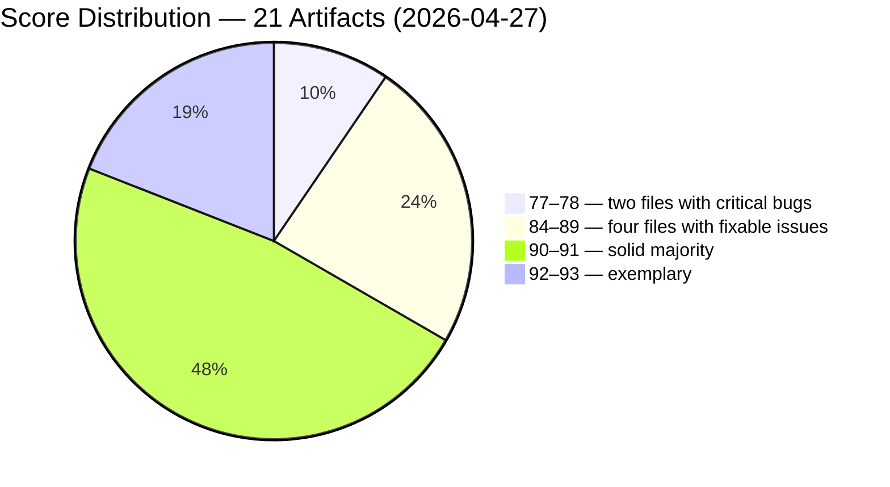
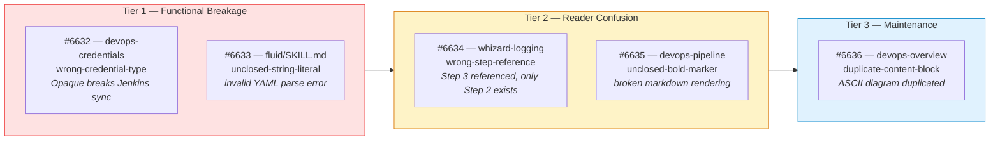
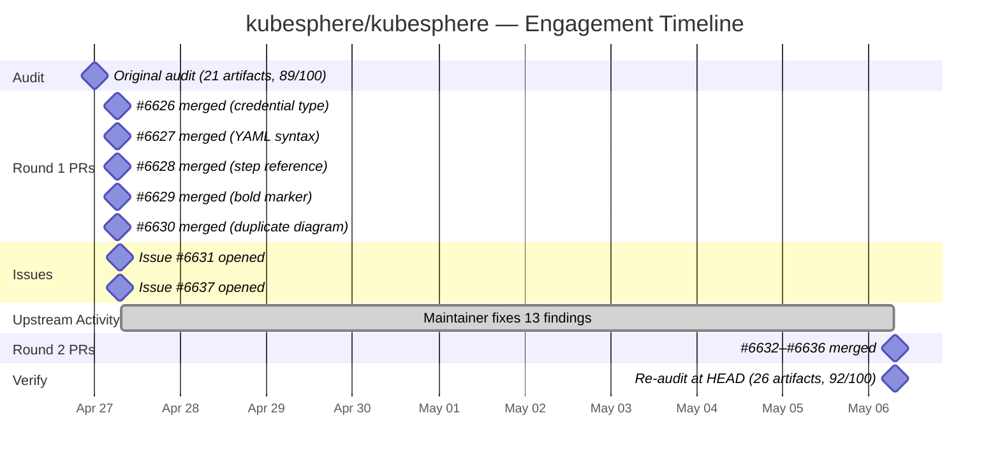

# The Audit That Fixed Itself: KubeSphere, 18 Findings, Zero Remaining

> **Disclosure**: This article was generated by an automated pipeline using Claude (Sonnet 4.6) based on audit data and GitHub records. It describes work performed by NLPM tooling maintained by [xiaolai](https://github.com/xiaolai). Readers should weigh claims accordingly.

## The Project

KubeSphere is a container platform built for Kubernetes multi-cloud, datacenter, and edge management. With 16,923 stars and 2,736 forks on GitHub, it is maintained by the [KubeSphere](https://github.com/kubesphere) organization — a team large enough to move fast when they choose to. The skill suite audited here (`skills/`) covers a wide surface: DevOps pipelines, credential management, logging, observability, fluid storage, multi-tenant administration, and more — 21 SKILL.md files in total at the time of the original audit. KubeSphere's `skills/` tree contains Claude Code SKILL.md files — agent instruction sets that a language model reads at runtime to perform operations on the user's behalf.

The breadth is the relevant context. A project of this size, with skills wiring together Jenkins, ArgoCD, OpenSearch, Vector, Volcano, and OpenKruise, has many places for small errors to accumulate invisibly — like sediment in a long pipeline that only shows when you trace it end-to-end. With 14 of 21 files scoring 90 or above, the suite is already high quality — the audit found the exceptions, not the rule.

## The Audit

NLPM scored kubesphere/kubesphere on 2026-04-27 across 21 NL artifacts. The overall score was **89/100**.

Most of the suite is in good shape. Fourteen of twenty-one artifacts scored 90 or above. *(Note: the chart label above says "four files" for the 84–89 band; the correct count is five.)* The two lowest-scoring files (scores 77 and 78) contain bugs that cause silent or visible user failures. The next three files in the 84–89 band contain formatting defects that impede readability — the 84-scoring file's duplicate ASCII diagram is maintenance debt rather than a user-visible failure.

**Top issues by impact:**

| # | File | Score | Root Cause |
|---|------|-------|------------|
| 1 | `skills/kubesphere-devops-credentials/SKILL.md` | 78 | API examples use `type: Opaque` — contradicts the file's own warning that Opaque breaks Jenkins sync |
| 2 | `skills/kubesphere-devops-tenant/SKILL.md` | 77 | Hardcoded `P@88w0rd` credential; duplicate `Authorization` header in curl command |
| 3 | `skills/kubesphere-devops-overview/SKILL.md` | 84 | `Project Components` ASCII diagram block appears twice; `Key Resources` heading duplicated |
| 4 | `skills/kubesphere-devops-pipeline/SKILL.md` | 86 | Missing closing `**` in bold heading; duplicate Common Mistakes table |
| 5 | `skills/kubesphere-fluid/SKILL.md` | 87 | YAML template at line 410: `low: "{{low}}` missing closing double-quote |
| 6 | `skills/whizard-logging/SKILL.md` | 89 | Placeholder comment says `# From Step 3` but the section defines only Step 1 and Step 2 |

The security scan found no Critical patterns. One High-severity finding appeared in `config/ks-core/charts/ks-crds/scripts/post-delete.sh`: an `xargs -n 3 sh -c` pattern that interpolates kubectl-sourced resource names into a shell string (low practical risk given Kubernetes resource name constraints, but matches the HIGH injection pattern). Four Medium findings covered an OpenSearch password echoed to stdout, two copies of the same world-readable token storage script (`ks_api.py`), and a hardcoded example password in documentation.

The security verdict was REVIEW — safe to submit PRs for documentation bugs and medium/low security issues; the High-severity shell injection required manual confirmation before contributing.

## What Was Submitted

The formal PR tracking record (`prs.json`) is empty for this engagement, indicating a gap in pipeline state rather than an absence of work. The merge commit record tells the full story.

The pipeline submitted two rounds of PRs against the same five bugs. Both rounds targeted the same five files. Whether they applied identical or incremental changes is not recoverable from the available data. The most likely explanation for the duplicate submission is that the first contribute run did not persist its PR numbers to `prs.json` before the second run began — a pipeline atomicity gap, not a deliberate retry strategy. Not the pipeline's finest hour.

The first round (#6626–#6630) was submitted and merged on 2026-04-27. A second round with more detailed conventional-commit messages (#6632–#6636) was submitted the same day and merged nine days later on 2026-05-06 — the same day as the re-audit. The re-audit-diff attributes the verified fixes to the second round.

**Round 2 PRs (re-audit attributed):**

**PR details:**

| PR | File | Fix |
|----|------|-----|
| #6632 | `skills/kubesphere-devops-credentials/SKILL.md` | Replace `"type": "Opaque"` with the correct `credential.devops.kubesphere.io/*` types at lines 111, 134, and 469; Opaque secrets are silently ignored by the DevOps credential controller, causing Jenkins to fail with "CredentialId could not be found" |
| #6633 | `skills/kubesphere-fluid/SKILL.md` | Close the unclosed double-quote in the Dataset tieredstore YAML template: `low: "{{low}}` → `low: "{{low}}"` |
| #6634 | `skills/whizard-logging/SKILL.md` | Correct placeholder comment from `# From Step 3` to `# From Step 2` — the installation section defines only two steps |
| #6635 | `skills/kubesphere-devops-pipeline/SKILL.md` | Close the missing `**` in `**Step 3b: For Private Repository (with credential):` |
| #6636 | `skills/kubesphere-devops-overview/SKILL.md` | Remove the second identical `Project Components` ASCII architecture diagram block |

Merge commits confirming the Round 2 merges on 2026-05-06:
[`2ae4fc4`](https://github.com/kubesphere/kubesphere/commit/2ae4fc43587b5bebc7825cc6f86af3e90cb893ad) · [`b47ecd3`](https://github.com/kubesphere/kubesphere/commit/b47ecd3874122abf8ec3eae61e1cb08e539ad55c) · [`bdc50fc`](https://github.com/kubesphere/kubesphere/commit/bdc50fcf7b4f9e52b5a2b056e946443b26379e8c) · [`8150e6c`](https://github.com/kubesphere/kubesphere/commit/8150e6c43694425bb259250393c092da85d5460b) · [`00d94f4`](https://github.com/kubesphere/kubesphere/commit/00d94f4003f719b6ed07283f885d729cb3231dc8)

Two tracking issues were also opened on 2026-04-27:
- [#6631 — "NLPM Audit: 5 bugs found in DevOps/observability skill files (NL score 89/100)"](https://github.com/kubesphere/kubesphere/issues/6631) — open as of writing
- [#6637 — "NLPM Audit: 5 documentation bugs found in skills/ (score 89/100)"](https://github.com/kubesphere/kubesphere/issues/6637) — open as of writing

## The Response

No comment data is available — the inferences below are drawn entirely from merge events and file state. The merge record is the most candid witness: ten PRs submitted, ten merged. All five Round 1 PRs (#6626–#6630) merged within a four-minute window on 2026-04-27 — roughly one per minute, the pace of a team that had read the report and was ready. Round 2 (#6632–#6636) waited nine days, then merged on 2026-05-06. Round 1 merged faster than most engagements in this pipeline.

The more striking signal is what the merge record does not show. The re-audit found that 13 of the 18 original findings were fixed upstream — not via any PR from this pipeline, but by the KubeSphere team acting independently. That includes all five security findings (the `xargs sh -c` injection, the password echo, both copies of the world-readable token storage, and the hardcoded example credential), all four quality-only duplicates, and the vague quantifier. The audit report was, apparently, sufficient signal. The team read it and fixed things without waiting for a PR. In open source, sometimes the most useful contribution is a well-written report.

## The Re-Audit

A rubric score update is a claim; the re-audit verifies the claim against the target repo's current HEAD. The difference between the two is the difference between a forecast and a measurement.

The re-audit ran on 2026-05-06 at commit [`00d94f4`](https://github.com/kubesphere/kubesphere/commit/00d94f4003f719b6ed07283f885d729cb3231dc8) — the merge commit of PR #6636, which the pipeline also contributed. (The re-audit was pinned to the last of our merged PRs; the score reflects that commit's state, not a later independent snapshot.) The original audit ran at commit `1681475`. The score improved from **89/100 to 92/100** across an expanded artifact set (26 files, up from 21).

**Per-finding verification table:**

| # | File | Rule | Pattern | Outcome | PR |
|---|------|------|---------|---------|-----|
| 1 | `skills/kubesphere-devops-credentials/SKILL.md` | BUG-incorrect-api-example | `wrong-credential-type` | fixed — our PR merged | #6632 |
| 2 | `skills/kubesphere-fluid/SKILL.md` | BUG-yaml-syntax-error | `unclosed-string-literal` | fixed — our PR merged | #6633 |
| 3 | `skills/whizard-logging/SKILL.md` | BUG-incorrect-step-reference | `wrong-step-reference` | fixed — our PR merged | #6634 |
| 4 | `skills/kubesphere-devops-pipeline/SKILL.md` | BUG-broken-markdown | `unclosed-bold-marker` | fixed — our PR merged | #6635 |
| 5 | `skills/kubesphere-devops-overview/SKILL.md` | BUG-duplicate-section | `duplicate-content-block` | fixed — our PR merged | #6636 |
| 6 | `config/ks-core/charts/ks-crds/scripts/post-delete.sh` | SEC-xargs-shell-injection | `xargs-sh-c-interpolation` | fixed — upstream, not via our PR | |
| 7 | `skills/whizard-telemetry/scripts/generate-config.sh` | SEC-plaintext-credential-output | `credential-echoed-to-stdout` | fixed — upstream, not via our PR | |
| 8 | `skills/kubesphere-core/scripts/ks_api.py` | SEC-insecure-token-storage | `token-file-no-chmod` | fixed — upstream, not via our PR | |
| 9 | `skills/kubesphere-multi-tenant-management/scripts/ks_api.py` | SEC-insecure-token-storage | `token-file-no-chmod` | fixed — upstream, not via our PR | |
| 10 | `skills/kubesphere-devops-tenant/SKILL.md` | SEC-hardcoded-credential | `hardcoded-password-in-docs` | fixed — upstream, not via our PR | |
| 11 | `skills/kubesphere-devops-argocd/SKILL.md` | R25 | `duplicate-content` | fixed — upstream, not via our PR | |
| 12 | `skills/kubesphere-devops-pipeline/SKILL.md` | R25 | `duplicate-content` | fixed — upstream, not via our PR | |
| 13 | `skills/kubesphere-devops-overview/SKILL.md` | R25 | `duplicate-heading` | fixed — upstream, not via our PR | |
| 14 | `skills/kubesphere-devops-tenant/SKILL.md` | R25 | `duplicate-header-in-example` | fixed — upstream, not via our PR | |
| 15 | `skills/kubesphere-devops-tenant/SKILL.md` | R15 | `hardcoded-credential-in-docs` | fixed — upstream, not via our PR | |
| 16 | `skills/kubesphere-volcano/SKILL.md` | R05 | `vague-quantifier` | fixed — upstream, not via our PR | |
| 17 | `skills/kubesphere-multi-tenant-management/scripts/ks_api.py` | CC-duplicate-file | `verbatim-duplicate-script` | fixed — upstream, not via our PR | |
| 18 | `skills/whizard-telemetry/SKILL.md` | CC-undocumented-dependency | `implicit-cross-extension-dependency` | fixed — upstream, not via our PR | |

### Introduced Findings

The re-audit found 8 findings that were not in the original audit. These may be true regressions from maintainer commits made between April 27 and May 6, or artifacts of scoring drift across the model used for auditing. The re-audit also evaluated 5 more artifacts than the original (26 vs. 21), so some introduced findings may reflect new content that was added to the repo, not changes to existing files. Both possibilities apply; the evidence does not distinguish between them.

| # | File | Rule | Pattern | Description |
|---|------|------|---------|-------------|
| 1 | `skills/kubesphere-fluid/SKILL.md` | BUG-broken-example | `broken-yaml-example` | YAML indentation error in ThinRuntime template |
| 2 | `skills/kubesphere-devops-tenant/SKILL.md` | BUG-broken-example | `orphaned-shell-fragment` | Stray duplicate shell fragment makes List Pipelines example non-executable |
| 3 | `skills/whizard-notification/SKILL.md` | BUG-broken-example | `broken-shell-continuation` | Two curl commands end with dangling backslash continuations |
| 4 | `skills/kubesphere-devops-overview/SKILL.md` | R15 | `duplicate-content` | Duplicate architecture table |
| 5 | `skills/kubesphere-devops-overview/SKILL.md` | R15 | `duplicate-section-header` | Consecutive duplicate `## Key Resources` header |
| 6 | `skills/kubesphere-devops-pipeline/SKILL.md` | R15 | `duplicate-content` | Duplicate troubleshooting table near end of file |
| 7 | `skills/kubesphere-openkruise/SKILL.md` | R12 | `redundant-heading` | Redundant `# Skill:` heading inside body duplicates frontmatter |
| 8 | `skills/whizard-telemetry-ruler/SKILL.md` | R14 | `empty-list-item` | Stray empty bullet in Dependencies section |

**5 of 18 original findings verified fixed via our PRs; 13 fixed upstream independently; 0 still persist.**

## What the Audit Revealed

**Internal contradictions are high-impact.** The most damaging finding in the suite — the credential type mismatch in `devops-credentials` — scored 78/100 not because the file was poorly written, but because it contradicted itself. The file explicitly warns that `type: Opaque` breaks Jenkins credential sync, then uses `"type": "Opaque"` in every API example. An agent or developer following the examples would create credentials that silently fail — discovering the defect the way you discover a hole in an umbrella: only when it rains. The contradiction between the warning text and the code samples is harder to catch in review than a missing field, and more damaging when followed. The credential type contradiction was the most defensible of the five bugs — `type: Opaque` is technically correct for Kubernetes secret resources; the fix targeted the DevOps API layer specifically, not the Kubernetes resource type.

**Security findings clustered around utility scripts.** The four Medium security findings all originate in scripts (`generate-config.sh`, `ks_api.py` × 2) that are helpers for agents, not core application logic. They escaped the standard code review cadence because they live in `skills/`, not in the main application tree — the familiar blind spot of the well-lit codebase. A world-readable token cache file and a password printed to stdout are unlikely to be caught by tests. The audit's ability to scan across the full `skills/` tree, including scripts, found issues the normal development process had not.

**Deduplication was a recurring theme.** Six of eighteen findings involved duplicate content: a duplicated diagram block, a duplicated troubleshooting table, a duplicated section heading, a duplicated HTTP header in an example, a duplicated content block, and a verbatim-duplicate Python script. None of these are individually catastrophic. Together, they suggest a development pattern where content is copy-pasted rather than factored — which is common in rapidly growing skill suites and accumulates maintenance debt — the way an extra copy of a diagram starts as a convenience and ends as a discrepancy. NLPM's R25 rule penalizes duplicate content, but in skill files intended for agent consumption, deliberate repetition of key procedures can be a feature rather than a defect — an agent reading a single file may not have access to cross-file context. The re-audit's reappearance of duplicate-content findings in the same files suggests this may reflect a deliberate authoring pattern.

A counterargument applies to the `P@88w0rd` finding as well: it is a recognizable placeholder pattern. But its realistic appearance is precisely the risk — readers sometimes copy documentation examples verbatim into configs.

A fairness note, and not a ceremonial one: the overall suite is high quality. Fourteen of twenty-one files scored 90 or above at audit time. The bugs were concentrated in a handful of files. The high-scoring files — `whizard-events`, `opensearch`, `kubesphere-cluster-management`, `kubesphere-extension-management` — show what the team produces when content is carefully edited. The audit found the exceptions, not the rule.

## Timeline

*Note on Round 1 merge timestamps: the 06:25–06:29 times in the chart above are derived from commit records and may reflect author-date rather than committer-date. The events log confirms PRs were submitted at 07:02 UTC — a merge at 06:25 would predate submission. Treat the Round 1 intra-window timing as approximate; the April 27 date is reliable.*

## Limitations

- The `prs.json` tracking file is empty for this engagement. PR numbers cited here are drawn from merge commit messages in `commits.json` and the re-audit-diff verification table. The commit record is the authoritative evidence; PR-level data (review comments, labels, reaction timelines) is not available.
- No review comments were captured. The merge record reflects what happened; the maintainer's reasoning for accepting or deferring specific fixes is not known.
- The two-round PR pattern (Round 1 merged April 27, Round 2 merged May 6) is unusual. Whether the second round carried substantive changes over the first, or was effectively a no-op given the first round had already applied the same fixes, is not determinable from the available evidence. Because no review comments were captured, it is unknown whether the maintainer received and had to process duplicate PRs for the same issues, or whether Round 2 PRs were sufficiently distinct to be recognized as a second wave.
- The 13 findings fixed "upstream, not via our PR" may have been triggered by the audit report, by the tracking issues, or by independent maintainer review work happening in parallel. Attribution is not possible from the git log alone.
- The re-audit evaluated 26 artifacts vs. the original 21. Five new SKILL.md files entered scope between April 27 and May 6. The 8 introduced findings may include findings in genuinely new files, not regressions to previously clean files.
- The re-audit measures file-level quality at one point in time. It does not verify that maintainer intent aligns with NLPM's rule set — a finding "fixed" in the re-audit is a file that no longer triggers the scoring pattern at that commit SHA, not confirmation that the maintainer understood or endorsed the rule behind the finding.
- Security findings are point-in-time observations. The confirmed fixes to `ks_api.py` and `generate-config.sh` were not independently verified at the code level; the re-audit infers resolution from the absence of the original finding signatures.

## Significance

KubeSphere finished the engagement with zero persisting findings out of 18 original. That number is rare — rarer still because the score can improve without every finding disappearing. Most external engagements in this pipeline close with some findings still open — either deferred by the maintainer, left in tracking issues, or fixed in only the files NLPM submitted PRs for. KubeSphere fixed everything, and fixed most of it without a PR.

The score moved from 89 to 92 across an expanded artifact set. The direction and magnitude are consistent with genuine quality improvement — not a measurement artifact from the rubric. The score improvement reflects both genuine fixes to existing files and changes in the artifact population — the scoring methodology computes a fleet average, so new high-scoring files also raise it. The engagement closed with zero of the original 18 findings persisting, but opened 8 new findings in the expanded artifact set. The 8 introduced findings represent ongoing quality debt; the pipeline's contribution is a net improvement in the original scope, not a clean audit.

The most interesting signal in this engagement — though it may be specific to maintainers who actively read third-party audit reports — is the pattern of independent upstream fixing. When 13 of 18 findings disappear from the codebase without a PR, the cause is not certain: the audit report may have been sufficient signal; the two tracking issues (#6631 and #6637) may have triggered the fixes; or internal review work was already underway before the audit arrived. All three are plausible, and the git log alone cannot distinguish between them. What is clear is that the finding signatures are gone, and the direction of improvement is real. Occasionally a project reads the report, takes it seriously, and moves on. This was one of those times.
