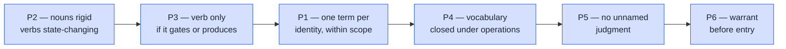
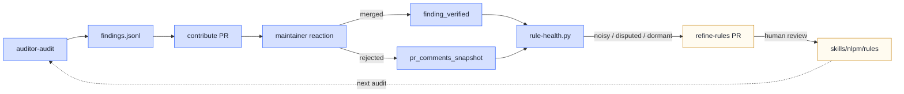

# Why NLPM is built

NLPM exists because a 69,816-star plugin shipped four invisible skills, and
no validator in the ecosystem was going to catch it.

That sentence is small enough to dismiss. The rest of this page argues why
it shouldn't be.

## The bug class that keeps shipping

`mattpocock/skills` (69.8k stars, MIT-licensed, written by a TypeScript
ecosystem figure with a reputation for rigorous tooling) shipped with 13
skills declared in `plugin.json` and 17 SKILL.md files on disk. The four
extras — `git-guardrails-claude-code`, `setup-pre-commit`,
`migrate-to-shoehorn`, `scaffold-exercises` — each had valid frontmatter
and worked locally. None of them were reachable after `claude plugin
install`.

The diff that finds this is mechanical:

```bash
diff <(jq -r '.skills[]' .claude-plugin/plugin.json | sort) \
     <(find skills -path 'skills/*/*/SKILL.md' | sed 's|/SKILL.md||;s|^|./|' | sort)
```

Five seconds. No judgment. No model needed.

This isn't an isolated lapse. The same bug class has shipped in
`safishamsi/graphify` (37k⭐), `kubesphere/kubesphere` (16k⭐),
`tanweai/pua` (16.7k⭐), and `agent-sh/agnix` (5k⭐). The maintainers are
not careless — they are using the tools that exist for the layer those
tools cover. The bug ships because no tool covers *this* layer.

## What the ecosystem already has

By 2026-05, there are at least eight SKILL.md / plugin-manifest validators
in active development:

| Source | What it checks |
|---|---|
| `claude plugin validate` (Anthropic, built-in CLI) | Manifest JSON syntax + deprecation warnings |
| `plugin-validator` agent (Anthropic) | Per-component frontmatter, manifest fields, security, MCP config |
| `skills-ref` (Linux Foundation, Python + Rust) | Per-skill: frontmatter validity, `name == parent_dir` |
| `claude-plugin-validate` (situ2001, Rust) | Manifest schema, frontmatter, hooks JSON |
| `agent-skill-linter` (William-Yeh) | Spec compliance, badges, LICENSE, auto-fix |
| `skill-check` (thedaviddias) | Structure, body limits, description quality, 0–100 score |
| `skill-validator` (agent-ecosystem) | Content density + pre-commit hooks |
| `skill-linter` ×2 (majesticlabs, RHEcosystem) | Marketplace gate logic |

The validators concentrate at the **single-artifact** boundary: does *this*
SKILL.md have a valid `name`? Does *this* `plugin.json` parse? At that
layer, eight tools compete and any one of them catches what the others
catch.

The validators avoid the **cross-artifact** boundary: does the array in
`plugin.json` enumerate every SKILL.md on disk? Does every tool in
`allowed-tools` have a call site? Do cross-references resolve?

`/nlpm:check` is, by current research, the only validator that
systematically checks this layer.

## Why the gap exists

Five compounding factors keep the bug class shipping:

1. **The right validator missing in canonical form.** Manifest-vs-disk
   isn't in Anthropic's official `plugin-validator`. Authors who reach
   for "the official tool" don't get this check.
2. **Discovery is broken.** Eight tools, no SEO winner, no GitHub Actions
   template that ships with `claude plugin init`. Authors don't know
   which tool to pick, so most pick none.
3. **The spec is young.** Anthropic published Agent Skills on
   2025-12-18. Five months is not enough time for collective practice
   to crystallize — TypeScript took about five years to settle on
   `tsc --noEmit` + ESLint + `tsconfig.json` as the canonical local
   validation stack.
4. **"Works on my machine" is the testing default.** Authors develop in
   their own `.claude/` directory; the runtime walks the filesystem and
   finds the skill. The bug only surfaces on a fresh install of the
   published manifest — a code path the author rarely exercises.
5. **No install-time loud failure.** `claude plugin install` succeeds
   with an incomplete manifest. Missing skills are silently invisible.
   There is no `ImportError`-equivalent that tells the author what they
   just published is broken.

Every successful code ecosystem has at least one install-time or
build-time gate that fails loudly on this class of inconsistency:

| Ecosystem | Forcing function |
|---|---|
| TypeScript / Node | Missing `exports` → `Cannot find module` at runtime |
| Python | Missing `entry_points` → `pkg_resources.DistributionNotFound` |
| Rust | `cargo build` cross-checks `mod` against `src/` |
| Ruby | `gem build` rejects gemspecs referencing missing files |
| Go | `go build` and `go vet` cross-check declared packages against disk |
| **Claude plugins** | None. Install succeeds with incomplete manifest. |

Plugin authoring doesn't have that gate yet. NLPM is one attempt to
provide it.

## The deeper observation

Patching one missing check would be a small open-source contribution.
NLPM is shaped around a bigger claim: **natural-language programs are
programs, and a program needs a vocabulary as much as it needs a syntax.**

A SKILL.md isn't prose. It is a declaration that an executor (Claude,
Codex, another agent) will read and act on. When two skills name the
same act with different verbs, when an agent says "scan" in one place
and "check" three lines later, when a noun-verb pairing exists in one
file and the inverted form in another — these aren't stylistic
preferences. They are the NL equivalent of redeclaring a function with a
different signature and hoping the linker figures it out.

This led to the six vocabulary principles (P1–P6)[^1], drawn from
OntoClean (Guarino & Welty), Domain-Driven Design (Evans), ISO 25964 /
ANSI-NISO Z39.19 warrant theory, and BPMN / Event Storming
(Brandolini):



The arrows are precedence — P2 takes precedence over P3, P3 over P1, and
so on. The order matters. P6 (warrant) is an entry check, not a veto over
terms that satisfy the higher principles, which is why deferred terms in
NLPM's own registry remain deferred rather than rejected.

These principles power R51 — NLPM's opt-in vocabulary-drift rule — and
the registry-free `/nlpm:vocab-drift` scan that ships alongside it.

## What NLPM is, framed by the gap

The shape of the tool follows from the two observations above.

| Component | Why it exists |
|---|---|
| `/nlpm:check` | Cross-artifact validation — the layer no other tool covers |
| `/nlpm:score` (51 rules, 100-point) | Quality scoring grounded in primary-source citations, not house style |
| `/nlpm:vocab-drift` + R51 | Vocabulary discipline; opt-in by design |
| `bin/nlpm-check` (stdlib-only Python) | Pre-commit / CI gate that runs without Claude Code |
| Auditor pipeline | Continuous corpus building — the rules get refined by contact with real plugins, not by speculation |
| Case studies + exemplars | Evidence trail; every rule cites real-world examples |

The two pipelines (local for authors, auditor for the corpus) share one
rulebook. Findings from the auditor feed `rule-health.py`. Rules that
generate noise get refined. Rules with strong real-world warrant become
exemplars that cite back into the rulebook. The loop is closed, and
only one step in it (rule refinement) is allowed to mutate the rulebook
— and only through a human-reviewed PR.

## How to use it

NLPM has five entry points; pick whichever fits the moment of your
workflow you want guarded.

### Inside Claude Code — slash commands

Once installed via `claude plugin install nlpm@xiaolai --scope project`,
you get the full surface:

| Command | What it does |
|---|---|
| [`/nlpm:ls`](/reference/) | Discover every NL artifact in the current repo |
| [`/nlpm:score`](/reference/scoring) | 100-point quality scoring against R01–R51 |
| [`/nlpm:check`](/install#what-nlpm-check-catches) | Cross-component checks — manifest-vs-disk, broken refs, orphans |
| `/nlpm:fix` | Auto-fix mechanical issues (rule numbers, frontmatter, hook event case) |
| `/nlpm:test` | Run NL-TDD specs against agents and skills |
| `/nlpm:trend` | Track score history over time |
| `/nlpm:report` | Self-contained HTML report (per-file scores, trend, vocab map) |
| [`/nlpm:vocab-init`](/reference/vocabulary) | Bootstrap a vocabulary registry for any project |
| [`/nlpm:vocab-drift`](/reference/drift) | Registry-free drift advisory — no commitment required |
| `/nlpm:security-scan` | Executable-surface scan (hooks, scripts, MCP, dependencies) |

Slash commands dispatch agents; agents load skills; skills cite rules.
The whole stack is markdown — nothing compiles, nothing locks you in.

### On the command line — `bin/nlpm-check`

For environments without Claude Code (CI, pre-commit, release scripts),
a single-file Python script (stdlib only, no `pip install`) runs the
deterministic subset:

```bash
nlpm-check .
# nlpm-check: 17 artifacts · 0 high · 0 medium · 0 low (.)
```

Exit code 0 (clean) / 1 (high-confidence findings) / 2 (errors). Works
on a 50-artifact plugin in under two seconds. See [the install
guide](/install) for the curl one-liner.

### At commit time — pre-commit hook

A drop-in template at
[`templates/pre-commit-nlpm.sh`](https://github.com/xiaolai/nlpm-for-claude/blob/main/templates/pre-commit-nlpm.sh)
that calls `nlpm-check`. Bad commits don't land — the "loud failure"
that the rest of the ecosystem doesn't provide.

### On every PR — GitHub Actions

A drop-in workflow at
[`templates/workflows/nlpm-check.yml`](https://github.com/xiaolai/nlpm-for-claude/blob/main/templates/workflows/nlpm-check.yml)
runs the check on every push and pull request. No secrets required; no
write scope unless you opt into auto-fix.

### On your README — the "Validated by NLPM" badge

The GHA workflow writes a shields.io-compatible JSON to the repo root.
Add this line to your README:

```markdown

```

The badge auto-updates each push to `main`:

| State | Color | Message |
|---|---|---|
| Clean | green | `0 issues · v0.8.x` |
| Advisory | yellow | `0 high · N advisory` |
| Failing | red | `N high issues` |

It is a public, machine-readable claim: "this plugin currently passes
NLPM's cross-component checks at the SHA the badge points to."

### As a consumer — the auditor dashboard

If you are evaluating a plugin you didn't write, the
[cross-repo dashboard](/dashboard) shows NLPM's audit of 200+ public
Claude Code plugins — score, security gate, vocabulary drift, and the
per-finding evidence trail. Each repo links to a full audit report
with the exact line numbers of every issue.

## The corpus, as of today

| Metric | Count |
|---|---|
| Repos audited | 210 |
| Case studies written | 28 |
| Exemplars cited in the rulebook | 62 |
| Rules in the rulebook | 51 |
| Vocabulary principles | 6 |
| NLPM's own self-audit score | 100 / 100 |

The corpus is what makes the rules trustable. A rule with no examples
in the wild is a hypothesis; a rule with a dozen exemplars is a
codified observation. The auditor pipeline is the mechanism that
converts the first into the second.

## How it evolves

NLPM is 8 weeks old. The first commit landed 2026-03-25; the current
release is v0.8.22. In between: 1,287 commits, five minor-version
gates (v0.2 → v0.4 → v0.6 → v0.7 → v0.8), and 22 patch releases since
v0.8.0 alone. The cadence is high because the rules keep getting
proven wrong by contact with real repositories — and the project's
shape is built to absorb that.

### The feedback loop



Everything before *refine rules* is automated observation. Only the
rule-refinement PR is allowed to mutate the rulebook, and only with a
human reviewer. That single human-gated step is what stops the loop
from amplifying its own noise.

### What the commit log shows

The pattern is visible in the version history. A few representative
commits:

| Commit | What changed | Why |
|---|---|---|
| `v0.7.15` | Tightened `BUG-missing-frontmatter` scope, pre-filtered security FPs | Auditor was flagging benign cases as critical |
| `v0.7.22` | Cleared 3 of 4 noisy rules — `CC-stale-count`, demoted `SEC-unpinned-semver` | Rule-health classified them as noisy after maintainer pushback |
| `v0.7.24` | Rebased scoring on the agent-skills.io open standard | Anthropic's name-on-commands optionality contradicted an in-house assumption |
| `v0.7.30` | Cited `code.claude.com/docs` as primary source for the name-on-commands rule | Repeat regression — pinned to the canonical doc, not derived knowledge |
| `v0.7.31` | 4-layer system to keep NLPM in sync with Claude Code docs | Stop the spec drift class entirely |
| `v0.7.34` | Scorer marks manifest-vs-disk diffs as `confidence: high` | Memory note: these are deterministic, never speculative |
| `v0.8.0` | Standalone `bin/nlpm-check` binary + author-side templates | Audit research showed pre-commit gates were what authors needed |
| `v0.8.17` | Exemplar pipeline — clean high-scoring audits become teaching artifacts | Positive warrant, not just negative findings |

None of these were ideas I had at the start. Each one is a response
to evidence the auditor produced.

### The artifacts that drive the loop

| Artifact | Purpose |
|---|---|
| [`auditor/findings.jsonl`](https://github.com/xiaolai/nlpm-for-claude/blob/main/auditor/findings.jsonl) | One record per finding, joined by deterministic fingerprint |
| [`auditor/disagreements.jsonl`](https://github.com/xiaolai/nlpm-for-claude/blob/main/auditor/disagreements.jsonl) | Maintainer pushback, classifier output, self-flagged false positives |
| [`auditor/logs/events.jsonl`](https://github.com/xiaolai/nlpm-for-claude/blob/main/auditor/logs/events.jsonl) | Lifecycle events — `finding_outcome`, `finding_verified`, `findings_aggregated` |
| [`auditor/scripts/rule-health.py`](https://github.com/xiaolai/nlpm-for-claude/blob/main/auditor/scripts/rule-health.py) | Classifies every rule as `healthy / noisy / disputed / dormant` |
| `auditor-refine-rules.yml` workflow | Weekly cron opens a PR with proposed rule edits; nothing merges without human review |

The rules in `skills/nlpm/rules/SKILL.md` cite specific exemplars and
case studies; the case studies link back to the merged PRs; the
merged PRs link back to the audits that found the issue. The chain
goes both ways. A rule with no evidence in the chain is a candidate
for refinement or removal.

## The wager

Three things could falsify the whole project:

1. **Anthropic adds manifest-vs-disk to the official `plugin-validator`.**
   This would erase NLPM's headline differentiation overnight.
   Probability: moderate; timeline: unknown. The mitigation is that the
   audit corpus and the rule-health feedback loop are the durable
   asset, not the single check.
2. **The ecosystem converges on one third-party validator.** Unlikely
   in the 5-month timeframe but possible by 2027. Today's
   fragmentation is the opportunity.
3. **Authors don't care.** If the bug class doesn't bother maintainers
   enough to install a hook, adoption stays at zero.

Joint probability of meaningful adoption: somewhere in the 20–35%
range, by honest accounting. The asymmetry is the case for shipping
anyway. Cost of being wrong: a couple of templates and a Python
script. Cost of being right and nobody else covering the gap: thousands
of plugins keep shipping with invisible bugs.

NLPM is the bet that the gap is worth filling, that vocabulary
discipline is worth naming, and that a corpus of real audits will
outlast any single rule.

[^1]: The principles document lives at
[`analysis/vocabulary-design-principles.md`](https://github.com/xiaolai/nlpm-for-claude/blob/main/analysis/vocabulary-design-principles.md)
in the repository, with the full precedence rationale and the OntoClean /
DDD / ISO 25964 / BPMN derivation. The shorter web-facing version is at
[/reference/principles](/reference/principles).
